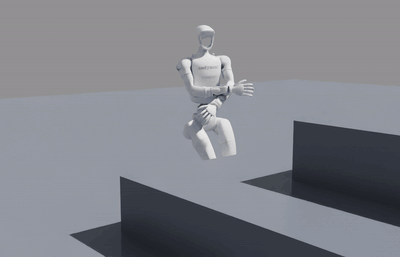

# G1 stairs: Unitree G1 climbing stairs while dancing

<p align="center"></p>

Reinforcement-learning policies for the **Unitree G1 (29 DoF)** that climb stairs blind (no camera or height map) while
the upper body dances, trained in **Isaac Sim 5.1 / Isaac Lab 2.3**, checked in **MuJoCo**, and rendered with
**Isaac Sim 6.0**. Everything runs in Docker.

It starts from the pretrained stair policy of [G1DWAQ_Lab](https://github.com/liuyufei-nubot/G1DWAQ_Lab) (DreamWaQ,
deployed on a real G1 by its authors) and adds:

- **Dances on the stairs**: fine-tunes with hand-keyframed dances, then a dance **retargeted from video** (MediaPipe
  pose → G1 joint angles) played on the arms while the policy learns to climb under it.
- **A skill layer**: pretrained policies from other repositories (e.g. NVIDIA
  [WBC-AGILE](https://github.com/nvidia-isaac/WBC-AGILE)) run behind one interface, each tested against its original.
- **Multi-teacher distillation**: one lower-body controller trained with PPO plus supervision from several teachers,
  while the upper body is free for any other skill.

Everything here is simulation only. Nothing in this repository has been run on a real robot.

## Released policies

All in `checkpoints/`, 2.6 MB each (weights and provenance, no optimizer state). Each one is a fine-tune of the one
above it.

| Checkpoint | Task | What it does | Measured |
|---|---|---|---|
| upstream `model_9999.pt` (in the submodule) | `g1_dwaq` | G1DWAQ_Lab stair policy, arms at rest | MuJoCo, 10 steps up + down, 12 starts: 12/12 crossings at 0.9 m/s |
| `g1_dwaq_strut.pt` | `g1_dwaq_strut` | stairs + keyframed Spider-Man 3 strut (run stopped at iteration 500) | climbs in Isaac Sim and MuJoCo; arm error 0.16 rad at iteration 300 |
| `g1_dwaq_groove.pt` | `g1_dwaq_groove` | stairs + an 8-beat arm routine modelled on Unitree's G1 dance video, with a dance clock in its input | climbs in Isaac Sim and MuJoCo; arm error 0.29 rad at iteration 300 |
| `g1_dwaq_bully.pt` | `g1_dwaq_bully` | stairs while the arms play the retargeted "Bully Maguire" clip | Isaac Sim: up, across and down, no fall; arms within 0.065 rad of the clip |
| `g1_body.pt` | `g1_body` | one lower-body controller distilled from `g1_dwaq_bully` + NVIDIA AGILE, under random upper-body motion | same stairs result as `g1_dwaq_bully`; **does not follow the crouch-height command yet** (0.10 m error) |

"Arm error" is the RMS joint-angle error of the arms and waist against the target dance.

## Quick start

Requirements: Linux, Docker with the NVIDIA Container Toolkit, an RTX GPU (developed on an RTX A2000 12 GB with driver
595). Pulling `nvcr.io/nvidia/isaac-sim` may need `docker login nvcr.io`.

```bash
git clone --recursive https://github.com/MHC-CodeSmith/g1_stairs.git
cd g1_stairs
docker compose build record           # MuJoCo demo image (~1.5 GB)
docker compose build train            # Isaac Sim 5.1 + Isaac Lab 2.3.2 + TienKung-Lab (~18 GB)
docker pull nvcr.io/nvidia/isaac-sim:6.0.0   # only for rendering Isaac videos (~21 GB)
```

GPU assignments in `docker-compose.yaml` (`NVIDIA_VISIBLE_DEVICES`) match the machine this was built on. Change them
if you have a single GPU.

**MuJoCo demo** (no Isaac Sim needed): the robot walks 10 steps up, across a platform and down, driven by an autopilot.

```bash
docker compose run --rm record                                           # upstream policy -> output/g1_stairs.mp4
docker compose run --rm record --checkpoint /checkpoints/g1_dwaq_groove.pt --out /output/groove.mp4
xhost +local: ; docker compose up viewer                                 # live MuJoCo window
```

It runs the upstream, strut and groove policies. `g1_dwaq_bully` and `g1_body` need the arm clip or the height command,
which only the Isaac Lab tasks provide.

**Isaac Sim video** (physics in Isaac Sim 5.1, rendering in Isaac Sim 6.0):

```bash
g1_strut/make_isaac_video.sh checkpoints/g1_dwaq_bully.pt bully --task g1_dwaq_bully
g1_strut/make_isaac_video.sh checkpoints/g1_body.pt body --task g1_body --upper bully   # or groove, strut, hold, random
```

Isaac Sim 5.1's RTX renderer crashed on driver 595 here (the stock NVIDIA image too), so `rollout_isaac.py` records
every link's pose from a headless 5.1 run and `render_isaac6.py` replays them in Isaac Sim 6.0.

**Training** (headless, 4096 robots, about 6 s per iteration on an RTX A2000):

```bash
T="docker compose run --rm train g1_strut/train.py --headless --num_envs 4096"
$T --task g1_dwaq_strut  --init_checkpoint /workspace/TienKung-Lab/logs/g1_dwaq/2026-01-16_00-46-00/model_9999.pt
$T --task g1_dwaq_groove --init_checkpoint checkpoints/g1_dwaq_strut.pt
$T --task g1_dwaq_bully  --init_checkpoint checkpoints/g1_dwaq_groove.pt
$T --task g1_body        --init_checkpoint checkpoints/g1_body.pt  --max_iterations 500   # continue the student
```

Logs and checkpoints go to `logs/<task>/<date>_<run>/`; export a checkpoint for release with
`tools/export_checkpoint.py`. When a task changes the observation (a dance clock or a height command),
`g1_strut/warmstart.py` maps the old weights onto the new input layout, with zero weights on new inputs so training
starts from the same behaviour.

## How it works

**Base policy.** DreamWaQ ("DWAQ"): an encoder reads the last 5 frames of the robot's own sensor readings and estimates
its velocity plus a 16-number terrain summary; the actor never sees the steps. The critic, used only in training, also
gets terrain heights and foot contacts. The policy runs at 50 Hz, physics at 200 Hz, and outputs joint targets for PD
motors.

**Dances.**
1. *Keyframed + reward* (`strut`, `groove`): hand-made arm poses locked to the gait clock, with a reward for matching
   them. One network then has to trade dancing against climbing, and the arms drift toward average poses.
2. *Retargeted clip played open-loop* (`bully`): `tools/extract_pose.py` (MediaPipe Pose) gets the dancer's 3D arm and
   torso positions from each frame; `tools/retarget_g1.py` solves G1 shoulder/elbow angles so each arm segment points
   the same way (MuJoCo forward kinematics, multi-start damped least squares; 90% of frames within 1.3°). The arms and
   waist twist play that trajectory directly and the policy learns to climb under it, with the clip's phase in its
   input. Episodes end on a real fall only, since the arm throws touch the chest.

   Your own clip:
   ```bash
   docker build -t g1-pose -f tools/Dockerfile.pose tools
   docker run --rm -v $PWD:/w -w /w g1-pose python tools/extract_pose.py my_clip.gif reference/my_pose.npz
   docker run --rm -v $PWD:/w -w /w --entrypoint python g1-stairs:latest tools/retarget_g1.py reference/my_pose.npz reference/my_g1.npz
   docker compose run --rm -e G1_DANCE_REF=/workspace/g1_stairs/reference/my_g1.npz train \
       g1_strut/train.py --headless --task g1_dwaq_bully --init_checkpoint checkpoints/g1_dwaq_bully.pt
   ```
   `tools/compare_clip.py` shows clip frames next to the retargeted robot; check it before training. Only
   `reference/bully_g1.npz` is tracked by git.

**Skill layer** (`skills/`). `adapters.py` rebuilds each imported policy's observation (term order, joint order,
defaults, scales, history) and action decoding, so any skill takes the same robot state and returns joint targets plus
the PD gains it was trained with. `gain_equivalent_target` converts a target between gain sets. `registry.yaml` lists
every skill with its source, license, joints, command and what it is good at.

- NVIDIA AGILE `Velocity-Height-G1-History-v0` (legs; command vx, vy, yaw rate, pelvis height): the adapter matches
  NVIDIA's ONNX export to within 1.7e-4 (`tests/test_agile_adapter.py`). In our Isaac Lab env (`skills/validate.py`) it
  walks within 0.03 m/s of the command with no falls when the arms are clear of the thighs, and still works with our
  PD gains remapped (0.045 m/s). Crouching stops at a pelvis height of about 0.62 m when 0.50 m is asked.
- Our DWAQ checkpoints: the adapter reproduces the trained policy exactly (VAE means).

**Distillation** (`g1_strut/body.py`, `g1_strut/distill.py`). The student drives the legs and waist pitch; a motion
library drives the upper body (the dance clips, fixed arm poses, random reaches). For each robot the teacher is NVIDIA
AGILE when standing on a flat tile with a height command, and `g1_dwaq_bully` everywhere else. The loss is PPO plus a
per-joint imitation term toward the active teacher, on the student's own states, faded from weight 1.0 to 0.05 so the
task reward takes over. The approach follows HANDOFF ([arXiv 2606.06493](https://arxiv.org/abs/2606.06493)), in a much
smaller form.

## Known limitations

- `g1_body` keeps the stair skill but ignores the crouch-height command: only about 4.5% of robots were in the crouch
  context and the imitation weight faded too early. Next: more crouch practice and a fixed imitation weight on the
  height joints.
- All policies are blind: step height is felt, not seen.
- The legs climb rather than dance; there is no hip sway or foot choreography.
- The simulated G1 has fingerless hands, so hand shapes from a clip can't be copied.
- The MuJoCo runner doesn't play arm clips or height commands.
- Not tested on hardware.

## Repository layout

| Path | Contents |
|---|---|
| `g1_strut/` | Isaac Lab tasks (strut, groove, bully, body), training, distillation, warm start, rollout and render scripts |
| `skills/` | skill adapters, registry, Isaac Lab runtime, validation checks, imported AGILE policy |
| `tools/` | pose extraction, retargeting, clip comparison, checkpoint export |
| `checkpoints/` | released policies |
| `run_stairs.py`, `eval_sweep.py`, `scenes/` | MuJoCo demo, robustness sweep, staircase scene |
| `docker/`, `docker-compose.yaml` | images: MuJoCo demo, Isaac Sim 5.1 training, Isaac Sim 6.0 render |
| `G1DWAQ_Lab/` | upstream training code and pretrained policy (git submodule) |

## License and credits

Code in this repository: Apache-2.0 (`LICENSE`). The checkpoints are fine-tunes of the G1DWAQ_Lab model and are
distributed under its BSD-3-Clause license; the imported AGILE files keep NVIDIA's license. Details:
`THIRD_PARTY_NOTICES.md`.

Built on [G1DWAQ_Lab](https://github.com/liuyufei-nubot/G1DWAQ_Lab), [TienKung-Lab](https://github.com/Open-X-Humanoid/TienKung-Lab),
[Legged Lab](https://github.com/Hellod035/LeggedLab), [RSL-RL](https://github.com/leggedrobotics/rsl_rl),
[Isaac Lab](https://github.com/isaac-sim/IsaacLab), [WBC-AGILE](https://github.com/nvidia-isaac/WBC-AGILE),
[MediaPipe](https://github.com/google-ai-edge/mediapipe) and [MuJoCo](https://github.com/google-deepmind/mujoco).
