# G1 arena report: every pretrained G1 policy, same robot, same tests

Generated on 2026-09-30 from `output/*.json` (copies in `docs/data/`) by `tools/build_report.py`. Numbers in tables come straight from the
result files; GIFs in `docs/media/` and charts in `docs/figures/` are regenerated by the commands at the end.

**Contents:**
- [What was done](#what-was-done)
- [How it works](#how-it-works)
- [Who climbs stairs best](#who-climbs-stairs-best)
- [Locomotion](#locomotion)
- [Motion tracking](#motion-tracking)
- [Our combined controller (g1_body)](#our-combined-controller-g1_body)
- [What each repository ships](#what-each-repository-ships)
- [Repository by repository](#repository-by-repository)
- [What could not be run, and why](#what-could-not-be-run-and-why)
- [Reproduce](#reproduce)

## What was done

- **Policies:** 18 pretrained policies from 12 repositories run on one simulated Unitree G1: 29 body joints plus Dex3
  hands, MuJoCo 3.6, 500 Hz physics, 50 Hz control. HumanoidBench supplies a stair course.
  - 13 locomotion controllers, 3 more general motion trackers (GMT, TWIST and GRAIL; SONIC doubles as a tracker) and
    2 dance trackers.
  - Plus our own distilled controller, `g1_body`.
- **Adapters:** each policy runs through an adapter that rebuilds its original observation, joint order, gains and
  action decoding.
  - 10 adapters are checked number for number against the repo's own control code (max difference 1.2e-5).
  - SONIC and unitree_rl_lab have no Python control loop to compare against; their adapters follow the C++ deploy
    code and were checked by behaviour.
- **Tests:** everything goes through the same tests.
  - Flat walking, no hands, rough ground, arms waving, pushes, crouching.
  - Three stair protocols: HumanoidBench's stair course, a step-height sweep, and Safe100's staircase.
  - Motion tracking on 11 clips.
- **Our controller:** we trained `g1_body`, one student controller distilled from two of these teachers (G1DWAQ for
  walking and stairs, GR00T WBC for crouching). It is the only policy here that does all of: stairs, crouching to
  0.52 m, 1000 N pushes and walking with the arms free.

**Short answers:**

- **Best stair climber.** G1DWAQ_Lab climbs the tallest steps (22 cm) and reaches the top in 100% of the Safe100
  staircase runs. Our `g1_body` scores the highest HumanoidBench return (622 vs 594) and climbs up to 20 cm. No other
  policy climbs a single step in the arena.
  - Safe100's policies climb 16/16 staircases inside their own simulator (MuJoCo-Warp) but fall within a second on
    CPU MuJoCo, even with their own compiled robot model (see [Safe100](#safe100humanoid-lzqw)).
- **Best walker (velocity tracking).** NVIDIA WBC-AGILE (0.016 m/s error). **Most robust to pushes:** G1DWAQ, SONIC
  and `g1_body` (1000 N). **Rough ground:** only holosoma (both), AGILE and SONIC finish.
- **Best motion tracker.** NVIDIA SONIC, among SONIC, GMT, TWIST and GRAIL on 11 clips.
  - Lowest heading error on all 11 clips and lowest root position error on 7; the only one that never falls.
  - Drift on long clips: GMT ends 14 m off on a 38 s walk.
  - Joint error is closer: GMT is lowest on 5 clips, SONIC on 4, GRAIL on 2.
  - GRAIL (a SONIC fine-tune for terrain and object tasks) tracks plain walking very well but falls on 4 of the 11
    clips, the most dynamic ones. Its stair result could not be measured (see [GRAIL](#grail-nvidia)).

## How it works

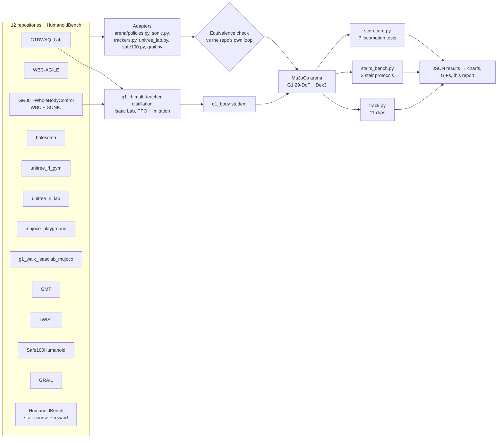

**Adapters.** Every repo has its own conventions: joint order (MuJoCo vs Isaac Lab), default pose, PD gains,
observation scales, history layout, gait clocks and action scaling. An adapter rebuilds all of that from the repo's
code and exposes one interface: `reset(state)` and `act(state, command) → joint targets`, plus the gains the policy was
trained with. The arena applies those gains per joint.

**Equivalence checks (`arena/check_adapters.py`, `tools/check_safe100.py`).** Where a repo has a Python control
loop, we run that loop unchanged, with its own robot model and GUI or network parts stubbed out. At every control step
we compare its observation and action with what our adapter computes from the same simulator state:

| adapter | reference run | max obs diff | max action diff |
|---|---|---|---|
| unitree_rl_gym | its `deploy_mujoco.py` loop | 1.5e-6 | 3.9e-7 |
| mujoco_playground | its `OnnxController` | 9.2e-7 | 4.6e-7 |
| gr00t_wbc | its `GearWbcController` | 0 | 0 |
| g1_walk37 (2) | its `run_grid` evaluator | 0 | 6.0e-8 |
| holosoma (2) | its `LocomotionPolicy` | 4.2e-6 | 1.0e-6 |
| GMT | its `sim2sim.py` | 7.4e-6 | 3.7e-6 |
| TWIST | its low-level sim server + high-level motion server | 3.9e-6 | 1.9e-6 |
| Safe100 (CBF) | its mjlab env on MuJoCo-Warp (GPU) | 1.2e-5 | — (its own actions) |
| GRAIL | none (Isaac Lab only); network + observations rebuilt from its code | — | — |
| G1DWAQ, AGILE, GR00T WBC (Isaac side) | `tests/test_*_adapter.py`, `skills/validate.py` | ≤ 1.7e-4 | |

SONIC and unitree_rl_lab only ship C++ deploy code, and GRAIL only runs inside Isaac Lab, so those adapters follow the
source line by line and were checked by behaviour instead (GRAIL: on flat clips it follows plain walking within
0.06 rad; a wrong observation layout falls within a second). unitree_rl_lab's dance policies track their clips with 0.08 rad joint error and never fall; a
wrong observation would make them fall within seconds.

**Tests** (all in `arena/`):

| test | what happens | score |
|---|---|---|
| flat | 20 s: stand, 0.5 then 1.0 m/s, walk + turn 0.5 rad/s, sidestep 0.3 m/s, stop | mean \|v − command\| |
| no hands | same on the G1 without Dex3 hands | same |
| rough | same on 6 cm random terrain | fell or not, velocity error |
| arms waving | same, with the arms the policy does not control swinging at 0.5 Hz | same |
| push | walking at 0.5 m/s, lateral pelvis pushes of 100 … 1000 N for 0.1 s every 3 s | largest push survived |
| crouch | pelvis height commands 0.62 / 0.52 / 0.70 m (policies with a height input) | height error, lowest height |
| stairs (scorecard) | 10 × 15 cm up, platform, 10 down at 0.6 m/s | crossed or not |
| HumanoidBench stairs | its course: 4 pyramids of 5 × 18 cm steps with 0.6 m treads; its reward, 1000 steps | return (max 1000) |
| step sweep | 8 up / platform / 8 down with rises of 8 … 24 cm | tallest rise crossed |
| Safe100 staircase | its evaluation stairs: 6 × 13 cm, 0.35 m treads, 16 randomised starts | % ending on top |
| tracking | reference clip from its first frame | joint, root position and heading errors |

Tracking runs stop before the trackers' look-ahead runs off the clip, so the same clip is shorter for SONIC, GMT, TWIST and GRAIL (19.2 s) than for unitree_rl_lab's own policy (21.1 s).

## Who climbs stairs best

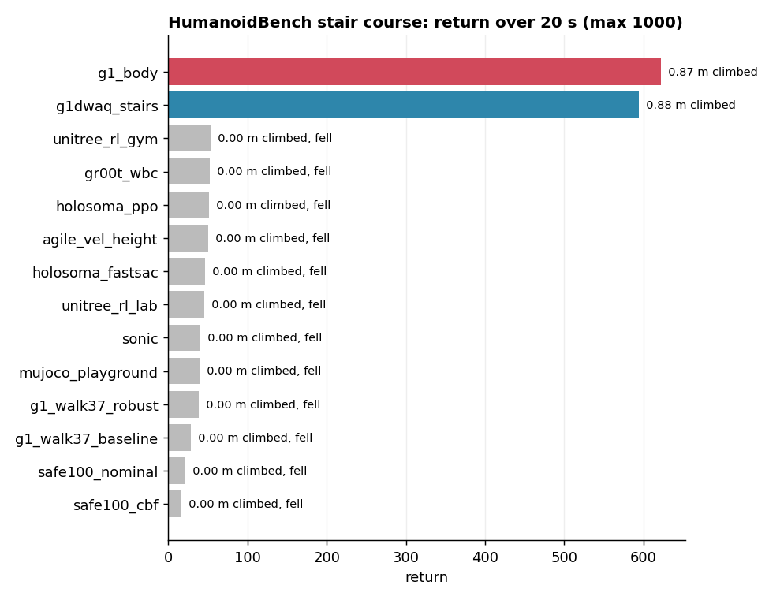

| # | policy | HumanoidBench return (max 1000) | climbed on HB course [m] | tallest step crossed | Safe100 staircase success |
|---|---|---|---|---|---|
| 1 | g1_body | 622 | 0.87 | 20 cm | 94% |
| 2 | g1dwaq_stairs | 594 | 0.88 | 22 cm | 100% |
| 3 | unitree_rl_gym | 53 (fell) | 0.00 | none | 0% |
| 4 | gr00t_wbc | 52 (fell) | 0.00 | none | 0% |
| 5 | holosoma_ppo | 51 (fell) | 0.00 | none | 0% |
| 6 | agile_vel_height | 50 (fell) | 0.00 | none | 0% |
| 7 | holosoma_fastsac | 47 (fell) | 0.00 | none | 0% |
| 8 | unitree_rl_lab | 45 (fell) | 0.00 | none | 0% |
| 9 | sonic | 41 (fell) | 0.00 | none | 0% |
| 10 | mujoco_playground | 40 (fell) | 0.00 | none | 0% |
| 11 | g1_walk37_robust | 38 (fell) | 0.00 | none | 0% |
| 12 | g1_walk37_baseline | 29 (fell) | 0.00 | none | 0% |
| 13 | safe100_nominal | 21 (fell) | 0.00 | none | 0% |
| 14 | safe100_cbf | 16 (fell) | 0.00 | none | 0% |

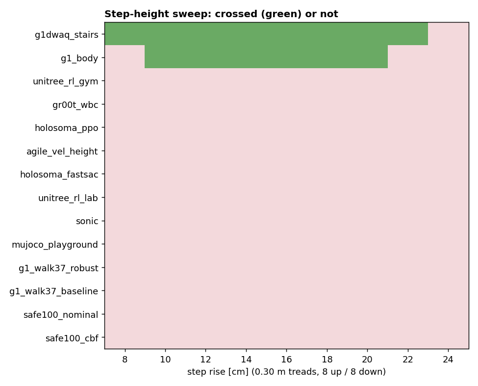

| policy | 8 cm | 10 cm | 12 cm | 14 cm | 16 cm | 18 cm | 20 cm | 22 cm | 24 cm |
|---|---|---|---|---|---|---|---|---|---|
| g1dwaq_stairs | ✓ | ✓ | ✓ | ✓ | ✓ | ✓ | ✓ | ✓ | · |
| g1_body | · | ✓ | ✓ | ✓ | ✓ | ✓ | ✓ | · | · |
| agile_vel_height | · | · | · | · | · | · | · | · | · |
| gr00t_wbc | · | · | · | · | · | · | · | · | · |
| sonic | · | · | · | · | · | · | · | · | · |
| holosoma_fastsac | · | · | · | · | · | · | · | · | · |
| holosoma_ppo | · | · | · | · | · | · | · | · | · |
| unitree_rl_lab | · | · | · | · | · | · | · | · | · |
| mujoco_playground | · | · | · | · | · | · | · | · | · |
| unitree_rl_gym | · | · | · | · | · | · | · | · | · |
| g1_walk37_baseline | · | · | · | · | · | · | · | · | · |
| g1_walk37_robust | · | · | · | · | · | · | · | · | · |
| safe100_cbf | · | · | · | · | · | · | · | · | · |
| safe100_nominal | · | · | · | · | · | · | · | · | · |

**On the HumanoidBench course.** HumanoidBench registers a native G1 stair environment (`g1-stair-v0`, its own
`g1_torque_stair.xml`, own G1 starting pose, and its reward class already lowers the stand-height target to 1.28 m for
a G1 instead of the H1's 1.65 m) — so the course itself is not an H1-only thing. What it does **not** ship is a
trained G1 policy: of its 2 released `.pt` checkpoints, both are for a reach task, and its published PPO/SAC/DreamerV3/
TD-MPC2 baselines were only run for the H1. The policies here never saw HumanoidBench's own reward, so the arena
rebuilds the course and a reward in the same spirit (not HumanoidBench's own gym env) to score them on it. Checked
directly: `gym.make("g1-stair-v0")` resets and steps correctly (87-d observation, 37-d action, the G1 with hands); a
zero-action rollout falls and terminates at step 37, as expected for no motor torque. This is a smoke test, not a
benchmark run — it confirms the env is real and not just dead registration code, nothing about any policy's quality.

- **Reward:** staying upright with the head high, small torques, and moving forward at up to 1 m/s. The arena measures
  head height above the feet (not above the ground, since the course has steps) and requires at least 1.2 m —
  close to, but not copied from, HumanoidBench's own 1.28 m absolute-head-height target for the G1.
- **G1 measurements:** head, feet and centre-of-mass velocity are taken as HumanoidBench's own G1 model defines them.
- **Results:** `g1_body` and G1DWAQ climb about 0.87 m, i.e. five 18 cm steps. Every other policy falls at the first
  step and scores about 16–53.

| HumanoidBench course | | |
|---|---|---|
| 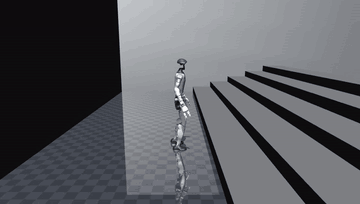 `g1_body` |  `g1dwaq_stairs` | 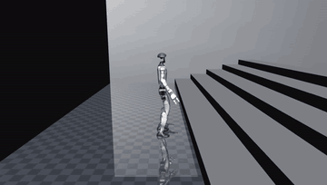 `sonic` |
| 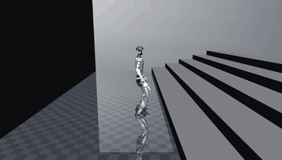 `agile_vel_height` | 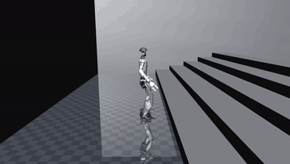 `holosoma_fastsac` | 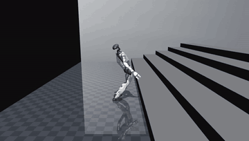 `safe100_cbf` |

| step sweep | 12 cm | 18 cm | 22 cm |
|---|---|---|---|
| `g1dwaq_stairs` | 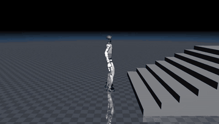 | 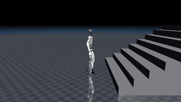 | 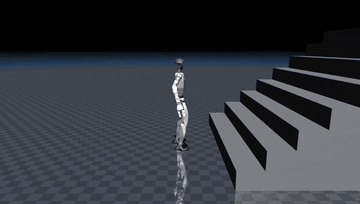 |
| `g1_body` | 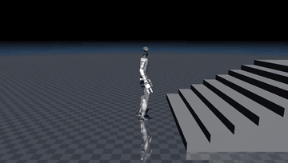 | 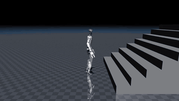 | 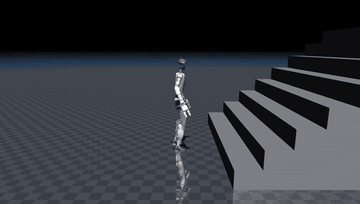 |
| `safe100_cbf` | 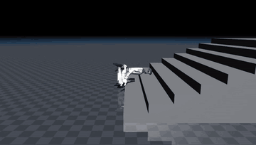 | 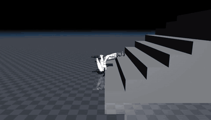 | 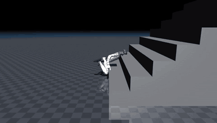 |

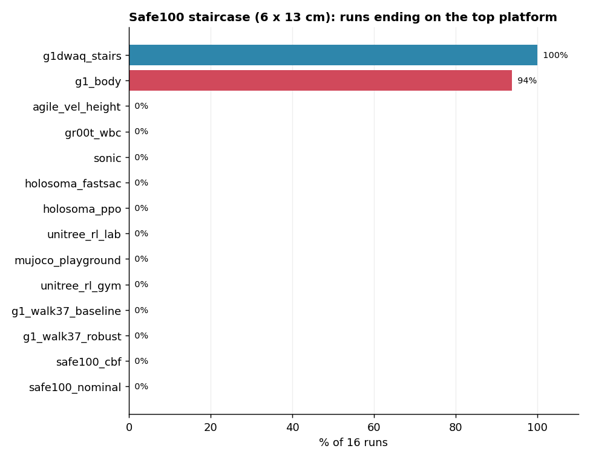

**Standard arena staircase (15 cm), every locomotion policy:**

| | | |
|---|---|---|
| 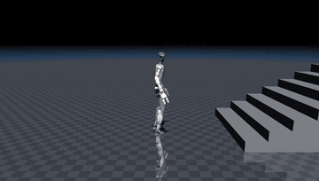 `g1_body` | 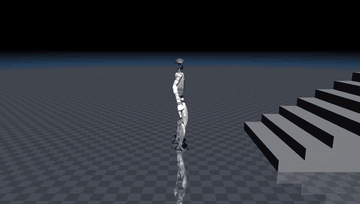 `g1dwaq_stairs` | 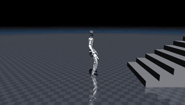 `gr00t_wbc` |
| 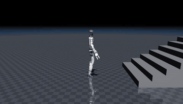 `sonic` | 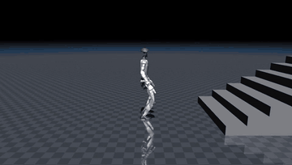 `agile_vel_height` | 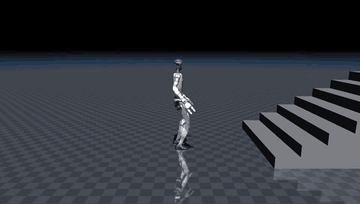 `holosoma_fastsac` |
| 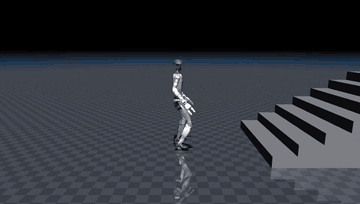 `holosoma_ppo` | 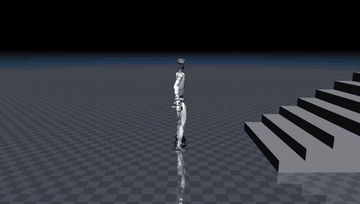 `unitree_rl_lab` | 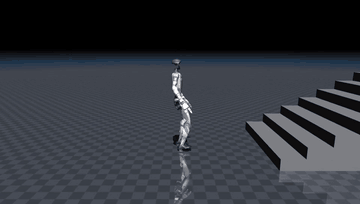 `unitree_rl_gym` |
| 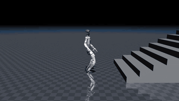 `mujoco_playground` | 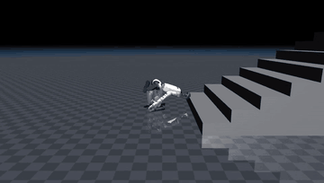 `safe100_cbf` | 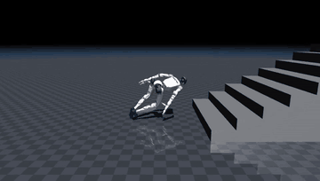 `safe100_nominal` |
| 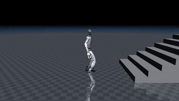 `g1_walk37_baseline` | 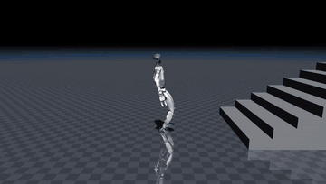 `g1_walk37_robust` | |

## Locomotion

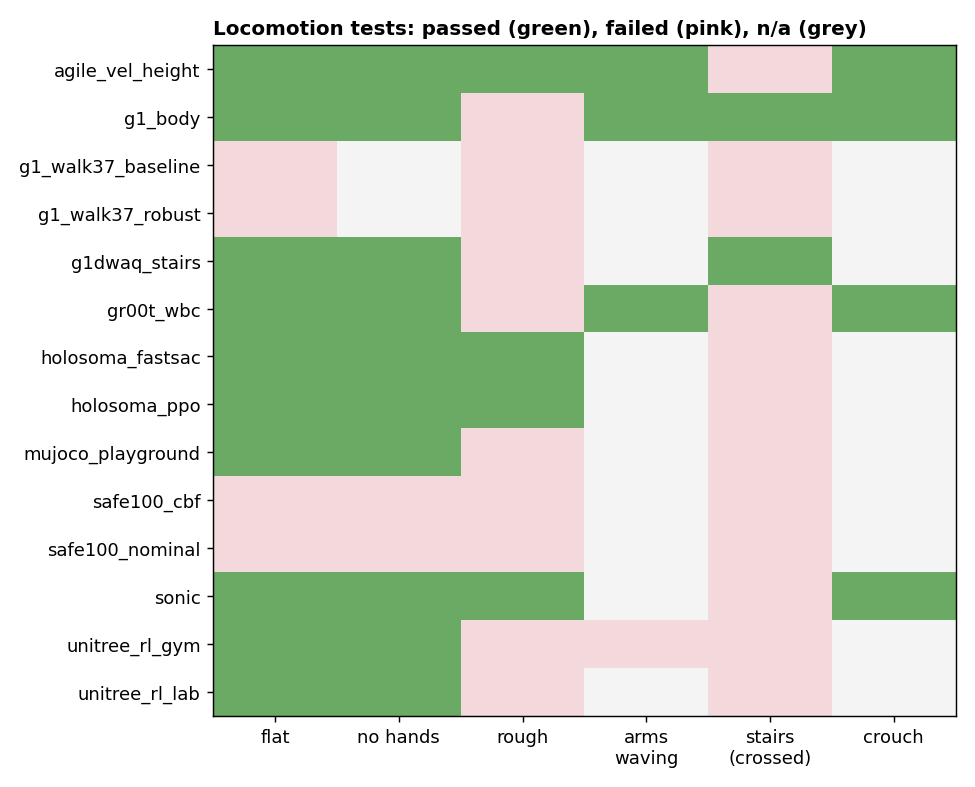

| policy | flat vx / wz err | no hands vx err | rough | arms waving vx err | push survived [N] | crouch err (lowest) |
|---|---|---|---|---|---|---|
| agile_vel_height | 0.016 / 0.064 | 0.026 | 0.073 | 0.063 | 400 | 0.060 (0.62 m) |
| g1_body | 0.049 / 0.275 | 0.048 | fell 15.1 s | 0.201 | 1000 | 0.003 (0.52 m) |
| g1_walk37_baseline | fell 18.2 s | needs hands | fell 3.0 s | n/a | 400 | n/a |
| g1_walk37_robust | fell 3.7 s | needs hands | fell 3.1 s | n/a | 300 | n/a |
| g1dwaq_stairs | 0.033 / 0.153 | 0.034 | fell 15.2 s | n/a | 1000 | n/a |
| gr00t_wbc | 0.047 / 0.137 | 0.052 | fell 14.5 s | 0.067 | 700 | 0.012 (0.50 m) |
| holosoma_fastsac | 0.101 / 0.079 | 0.114 | 0.131 | n/a | 700 | n/a |
| holosoma_ppo | 0.175 / 0.056 | 0.174 | 0.181 | n/a | 500 | n/a |
| mujoco_playground | 0.140 / 0.316 | 0.126 | fell 6.2 s | n/a | 300 | n/a |
| safe100_cbf | fell 0.9 s | fell 0.9 s | fell 0.9 s | n/a | 0 | n/a |
| safe100_nominal | fell 0.9 s | fell 0.9 s | fell 0.9 s | n/a | 0 | n/a |
| sonic | 0.104 / 0.241 | 0.102 | 0.121 | n/a | 1000 | 0.032 (0.57 m) |
| unitree_rl_gym | 0.116 / 1.140 | 0.211 | fell 13.3 s | fell 4.2 s | 500 | n/a |
| unitree_rl_lab | 0.064 / 0.165 | 0.065 | fell 11.1 s | n/a | 400 | n/a |

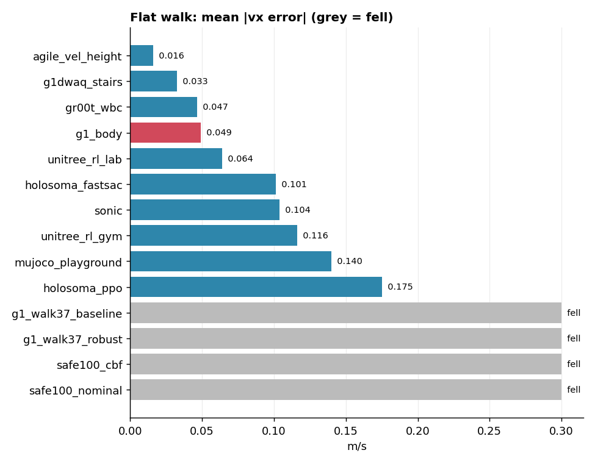 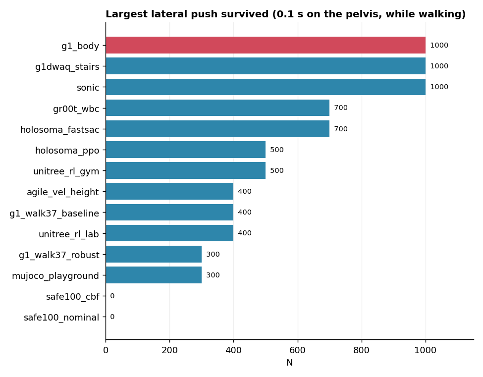

| crouch | | | |
|---|---|---|---|
| 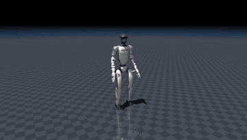 `g1_body` | 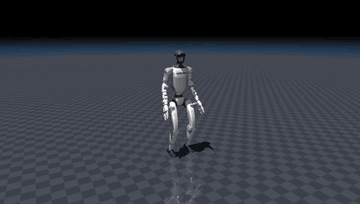 `gr00t_wbc` | 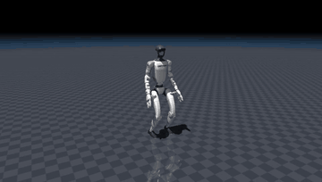 `agile_vel_height` | 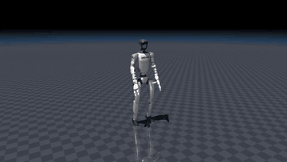 `sonic` |
| **pushes** | | | |
| 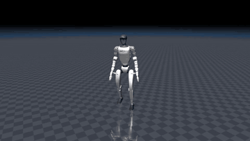 `g1_body` | 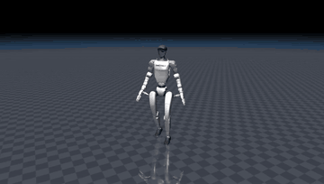 `g1dwaq_stairs` | 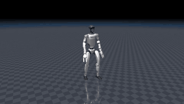 `sonic` | 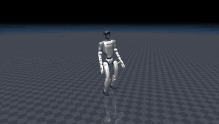 `agile_vel_height` |
| **rough ground** | | | |
| 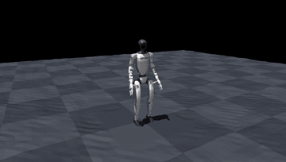 `g1_body` | 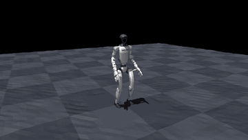 `holosoma_fastsac` | 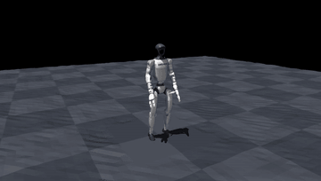 `sonic` | 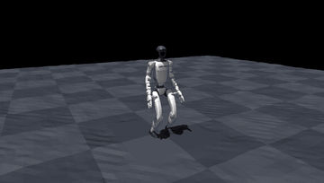 `agile_vel_height` |
| **arms waving** | | | |
| 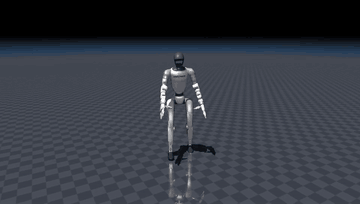 `g1_body` | 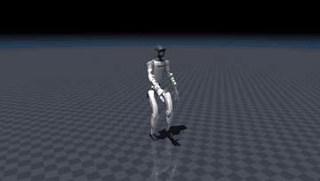 `gr00t_wbc` | 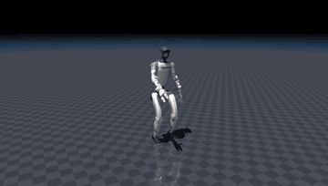 `agile_vel_height` |  `unitree_rl_gym` |

SONIC driven by its own motion planner (velocity commands → planned motion → tracked):


## Motion tracking


| clip | tracker | joint err [rad] | root xy err [m] (final) | heading err [rad] (final) | fell |
|---|---|---|---|---|---|
| gmt_airkick_stand (4.6 s) | gmt | 0.093 | 0.20 (0.34) | 0.24 (0.13) |  |
| gmt_airkick_stand (4.6 s) | twist | 0.105 | 0.38 (0.83) | 0.82 (1.24) |  |
| gmt_airkick_stand (4.6 s) | grail_terrain | 0.110 | 0.59 (1.37) | 0.08 (0.04) |  |
| gmt_airkick_stand (4.6 s) | sonic_tracking | 0.110 | 0.22 (0.36) | 0.04 (0.01) |  |
| gmt_basic_walk (37.1 s) | grail_terrain | 0.068 | 0.19 (0.26) | 0.05 (0.00) |  |
| gmt_basic_walk (37.1 s) | gmt | 0.075 | 1.45 (3.06) | 0.64 (2.18) |  |
| gmt_basic_walk (37.1 s) | sonic_tracking | 0.082 | 0.22 (0.20) | 0.04 (0.05) |  |
| gmt_basic_walk (37.1 s) | twist | 0.082 | 2.68 (3.36) | 1.67 (2.88) |  |
| gmt_crouchwalk_stand (5.5 s) | gmt | 0.123 | 0.54 (0.29) | 0.16 (0.10) |  |
| gmt_crouchwalk_stand (5.5 s) | grail_terrain | 0.124 | 2.10 (2.64) | 0.07 (0.13) |  |
| gmt_crouchwalk_stand (5.5 s) | twist | 0.124 | 0.53 (0.31) | 0.10 (0.07) |  |
| gmt_crouchwalk_stand (5.5 s) | sonic_tracking | 0.141 | 0.26 (0.39) | 0.04 (0.05) |  |
| gmt_dance (21.0 s) | sonic_tracking | 0.080 | 0.09 (0.32) | 0.03 (0.01) |  |
| gmt_dance (21.0 s) | gmt | 0.092 | 0.12 (0.61) | 0.27 (0.71) |  |
| gmt_dance (21.0 s) | twist | 0.128 | 0.54 (1.77) | 0.27 (0.83) |  |
| gmt_dance (21.0 s) | grail_terrain | 0.141 | 1.33 (5.88) | 0.07 (0.20) | fell 20.7 s |
| gmt_dance_waltz (6.1 s) | gmt | 0.067 | 0.26 (0.94) | 0.14 (0.09) |  |
| gmt_dance_waltz (6.1 s) | sonic_tracking | 0.069 | 0.16 (0.21) | 0.02 (0.02) |  |
| gmt_dance_waltz (6.1 s) | twist | 0.073 | 0.24 (0.40) | 0.28 (0.18) |  |
| gmt_dance_waltz (6.1 s) | grail_terrain | 0.110 | 0.45 (1.39) | 0.05 (0.04) |  |
| gmt_kick_walk (7.7 s) | gmt | 0.090 | 0.48 (0.59) | 0.41 (0.70) |  |
| gmt_kick_walk (7.7 s) | twist | 0.105 | 0.22 (0.38) | 0.21 (0.36) |  |
| gmt_kick_walk (7.7 s) | sonic_tracking | 0.109 | 0.10 (0.14) | 0.03 (0.02) |  |
| gmt_kick_walk (7.7 s) | grail_terrain | 0.117 | 1.00 (3.53) | 0.07 (0.03) |  |
| gmt_squat (3.0 s) | gmt | 0.093 | 0.05 (0.15) | 0.02 (0.02) |  |
| gmt_squat (3.0 s) | sonic_tracking | 0.112 | 0.03 (0.04) | 0.02 (0.02) |  |
| gmt_squat (3.0 s) | twist | 0.115 | 0.03 (0.03) | 0.04 (0.07) |  |
| gmt_squat (3.0 s) | grail_terrain | 0.218 | 0.18 (0.70) | 0.11 (0.20) | fell 2.5 s |
| gmt_walk_stand (5.4 s) | grail_terrain | 0.060 | 0.07 (0.13) | 0.03 (0.01) |  |
| gmt_walk_stand (5.4 s) | gmt | 0.070 | 0.22 (0.49) | 0.09 (0.14) |  |
| gmt_walk_stand (5.4 s) | sonic_tracking | 0.074 | 0.17 (0.40) | 0.02 (0.02) |  |
| gmt_walk_stand (5.4 s) | twist | 0.081 | 0.63 (1.12) | 0.34 (0.13) |  |
| sonic_walk (38.0 s) | sonic_tracking | 0.058 | 0.05 (0.12) | 0.02 (0.01) |  |
| sonic_walk (38.0 s) | grail_terrain | 0.066 | 0.44 (0.09) | 0.04 (0.03) |  |
| sonic_walk (38.0 s) | twist | 0.080 | 1.34 (0.60) | 0.30 (0.46) |  |
| sonic_walk (38.0 s) | gmt | 0.088 | 3.17 (14.13) | 1.06 (2.27) |  |
| unitree_dance_102 (21.1 s) | unitree_dance_102 (its own clip) | 0.080 | 0.11 (0.07) | 0.05 (0.07) |  |
| unitree_dance_102 (19.2 s) | sonic_tracking | 0.113 | 0.13 (0.22) | 0.05 (0.01) |  |
| unitree_dance_102 (19.2 s) | gmt | 0.127 | 4.26 (8.88) | 0.28 (0.08) |  |
| unitree_dance_102 (19.2 s) | twist | 0.141 | 1.46 (4.71) | 0.41 (0.58) |  |
| unitree_dance_102 (19.2 s) | grail_terrain | 0.173 | 4.26 (10.56) | 0.07 (0.63) | fell 16.3 s |
| unitree_gangnam_style (20.2 s) | unitree_gangnam_style (its own clip) | 0.081 | 0.26 (0.36) | 0.05 (0.00) |  |
| unitree_gangnam_style (18.3 s) | sonic_tracking | 0.143 | 0.44 (0.91) | 0.05 (0.10) |  |
| unitree_gangnam_style (18.3 s) | gmt | 0.176 | 1.18 (4.64) | 0.19 (0.57) | fell 4.3 s |
| unitree_gangnam_style (18.3 s) | grail_terrain | 0.194 | 0.46 (1.64) | 0.08 (0.32) | fell 2.1 s |
| unitree_gangnam_style (18.3 s) | twist | 0.218 | 1.32 (4.84) | 0.51 (0.00) | fell 4.7 s |

| clip | SONIC | GMT | TWIST | GRAIL |
|---|---|---|---|---|
| GMT dance |  |  |  |  |
| GMT kick walk |  |  |  |  |

unitree_rl_lab's dance policies on their own clips (`dance_102`, `gangnam_style`):

| | |
|---|---|
|  |  |

## Our combined controller (g1_body)


- **Student:** starts from the G1DWAQ weights and learns with PPO on the task reward plus an imitation term toward the
  teacher that fits the situation.
- **Gain conversion:** each teacher's joint targets are converted from its own PD gains to the student's
  (`gain_equivalent_target`).
- **Training:** 1500 iterations with 4096 robots on one RTX A2000.


**Checkpoint choice.** The G1DWAQ imitation weight anneals over training, and later checkpoints lose the stairs in the
arena. So the released checkpoint is iteration 700, not the last one:


**Next change:** keep the stair teacher's imitation weight high for longer. The student also inherits its teachers'
weakness on rough ground (it falls at 15 s); holosoma and AGILE, which finish that test, are the candidate teachers.

## What each repository ships

Some repositories advertise a lot (dozens of tasks, thousands of clips); others ship one policy. What matters for a
G1 is what comes **pre-trained and ready to run**. Counts below are from the repositories themselves (files present,
task registries), not from their READMEs.

### Skill matrix: what each policy can do

Read this first. Rows go from the **most skills** (a general tracker or a planner with dozens of behaviours) to the
**basics only** (just walking). Cells say what we saw in the arena, not what a README claims.

Legend: ✅ works in the arena · ⚠ works with clear limits · ❌ tested and fails · ○ shipped by the repository but not
tested by us · — not offered.

| policy | walk | rough ground | stairs | crouch / squat | kneel, crawl, lie | dance | kick, punch, karate | jump | sit, pick up, carry | any motion from a clip |
|---|---|---|---|---|---|---|---|---|---|---|
| **SONIC** (GR00T) | ✅ | ✅ | ❌ | ✅ (0.57 m) | ○ | ✅ (tracks dance clips) | ✅ kick clips · ○ boxing, punches, hooks | ○ forward jump | ○ carry object | ✅ best tracker |
| **GMT** | ✅ (drifts) | — | — | ✅ squat clip | — | ✅ | ✅ kick clips | — | — | ✅ (best joint error on 5 of 11 clips) |
| **TWIST** | ✅ (drifts) | — | — | ✅ squat clip | — | ⚠ (falls on Gangnam Style) | ✅ kick clips | — | — | ⚠ weakest tracker |
| **GRAIL** (SONIC fine-tune) | ✅ | — | ○ its purpose, not measurable here | ❌ falls on squat | — | ❌ falls on dances | ⚠ | — | ○ sitting, pick-up, curbs, slopes | ⚠ walking clips only |
| **unitree_rl_lab** | ✅ | ❌ | ❌ | — | — | ✅ 2 dances (own clips) | — | — | — | — |
| **holosoma** | ✅ (2 policies) | ✅ | ❌ | — | — | ○ 2 G1 dance trackers (not in the arena yet) | — | — | — | — |
| **BFM-Zero** | ○ | — | — | ○ | — | ○ | ○ | ○ | ○ | ○ prompts (downloaded, not adapted) |
| **GR00T WBC** (Walk/Balance) | ✅ | ❌ | ❌ | ✅ (0.50 m, lowest) | — | — | — | — | — | — |
| **WBC-AGILE** | ✅ (best velocity tracking) | ✅ | ❌ | ⚠ (0.62 m) | — | — | — | — | — | — |
| **G1DWAQ_Lab** | ✅ | ❌ | ✅ **22 cm** (best) | — | — | — | — | — | — | — |
| **Safe100Humanoid** | ❌ | ❌ | ❌ in the arena (16/16 in its own simulator) | — | — | — | — | — | — | — |
| **unitree_rl_gym** | ⚠ (weak turning) | ❌ | ❌ | — | — | — | — | — | — | — |
| **mujoco_playground** | ⚠ average | ❌ | ❌ | — | — | — | — | — | — | — |
| **g1_walk_isaaclab_mujoco** | ❌ (made for an older G1) | ❌ | ❌ | — | — | — | — | — | — | — |
| **g1_body** (ours) | ✅ | ❌ | ✅ **20 cm** | ✅ (0.52 m) | — | — | — | — | — | — |

How to read it:

- **SONIC is the only source with a wide list of behaviours in one model.** Its planner has 27 modes: idle, slow walk,
  walk, run, squat, two kneeling poses, lying, crawl, elbow crawl, boxing (idle, walk, punches, hooks), forward jump,
  several styled walks (stealth, injured, ledge, zombie, gun, scare, happy dance), and object carry. In the arena we
  measured walking, crouching, pushes, rough ground and its tracking of dance and kick clips; the other modes are
  shipped but we did not test them.
- **GMT, TWIST and GRAIL are trackers.** They do not have named skills: they copy whatever reference clip you give them,
  so dance, kick and squat all work if a clip exists. Their quality is the "tracking" table, not a skill list.
- **Everything below the trackers is a specialist.** unitree_rl_lab, holosoma, WBC-AGILE, GR00T WBC, unitree_rl_gym
  and mujoco_playground walk (with different quality); G1DWAQ and Safe100 climb stairs; unitree_rl_lab adds two dances
  and GR00T WBC and AGILE add crouching. Nobody outside SONIC ships jumping, punching or crawling as a ready policy.
- **Only two policies climb stairs in the arena** (G1DWAQ and our `g1_body`), and neither has any dance or kick.
  That gap is what `g1_body` is meant to close by distilling more teachers.

**Breadth vs depth in numbers.** Broad frameworks give you tools to train many things yourself; narrow repositories give
you one trained policy. Only the second kind can be benchmarked as-is.

| repository | headline breadth | pre-trained G1 policies actually shipped | tested in the arena |
|---|---|---|---|
| [mujoco_playground](https://github.com/google-deepmind/mujoco_playground) | ~49 locomotion environments (G1, T1, H1, Go1, Spot, Barkour, Apollo, OP3, Berkeley humanoid) plus manipulation (Panda, Aloha, LEAP, Aero hand) | **6 small sim2sim demo ONNX** (`experimental/sim2sim/onnx`), of which 1 is a G1; everything else you train yourself | the G1 demo policy (average; falls on rough ground) |
| [HumanoidBench](https://github.com/carlosferrazza/humanoid-bench) | 32 registered whole-body tasks (locomotion and manipulation), with native G1 variants (`g1-<task>-v0`) | **0 for the G1** (2 `.pt` files, both for a reach task, not G1); baselines are trained for the H1 | its stair course and reward as a test, not its policies |
| [mujoco_menagerie](https://github.com/google-deepmind/mujoco_menagerie) | about 70 robot models | not applicable (models only) | the G1 models |
| [holosoma](https://github.com/amazon-far/holosoma) | G1 and T1, PPO and FastSAC, IsaacGym / IsaacSim / MJWarp, retargeting, whole-body tracking | **6 ONNX**: G1 walking (2), T1 walking (2), **G1 dance tracking (2)** | G1 walking (2); the dance trackers are not in the arena yet |
| [unitree_rl_lab](https://github.com/unitreerobotics/unitree_rl_lab) | tasks for Go2, H1 and G1 in Isaac Lab | **3 G1**: velocity, 2 dances | all three |
| [unitree_rl_gym](https://github.com/unitreerobotics/unitree_rl_gym) | Go2, H1, H1_2, G1 | **1 G1** (12 leg joints; also H1 and H1_2) | the G1 policy |
| [WBC-AGILE](https://github.com/nvidia-isaac/WBC-AGILE) | G1 and T1 velocity, velocity + height, pick and place | we imported the G1 velocity + height policy; the other tasks' checkpoints were not checked | velocity + height |
| [GR00T-WholeBodyControl](https://github.com/NVlabs/GR00T-WholeBodyControl) | SONIC: one tracker, one planner with 27 locomotion modes (walk, run, crouch, crawl, boxing, jump, styled walks); decoupled WBC (walk + balance); teleoperation and deployment stack | **SONIC** (encoder, decoder, planner) **and WBC** (2 networks) | both; SONIC in planner and tracking mode |
| [GMT](https://github.com/zixuan417/humanoid-general-motion-tracking) | "general motion tracker" | **1** (23 joints, no hands) with 8 example clips | yes, on 11 clips |
| [TWIST](https://github.com/YanjieZe/TWIST) | whole-body teleoperation system with its dataset and training code | **1** general tracker | yes |
| [g1_walk_isaaclab_mujoco](https://github.com/yezzzzye/g1_walk_isaaclab_mujoco) | teaching project: train, fine-tune, export | **2** (baseline and robust), for an older 37-joint G1 | both (fall on our G1) |
| [Safe100Humanoid](https://github.com/lzqw/Safe100Humanoid) | one task: stairs with CBF-RL | **2** (CBF-trained and nominal) | both |
| [GRAIL](https://github.com/NVlabs/GRAIL) | data pipeline for stairs, curbs, slopes, sitting and pick-up; dataset with about 1000 clips per category | **3 tracking checkpoints** (`pnp_table`, `pnp_ground`, `terrain`) plus warm starts | `terrain` on flat clips; stairs not measurable |
| [G1DWAQ_Lab](https://github.com/liuyufei-nubot/G1DWAQ_Lab) | Isaac Lab tasks for G1 and H1, flat, rough, walk, run | **1** G1 stair policy (`g1_dwaq`) | yes; the best stair climber |
| [BFM-Zero](https://github.com/LeCAR-Lab/BFM-Zero) | one "promptable" model: reward, goal and motion-tracking prompts | **1** model (CC-BY-NC), many behaviours from prompts | downloaded, not yet adapted |

**What the numbers say.**

- **Most policies, least depth.** GR00T-WholeBodyControl (SONIC's 27 planner modes inside one model) and holosoma (6 ONNX
  across two robots and two tasks) are the richest sources of ready policies. In the arena SONIC also gave the best
  tracking and most robust pushing; holosoma was the only non-NVIDIA source that finished rough ground.
- **Most environments, almost no policies.** mujoco_playground and HumanoidBench advertise the largest catalogues (49 and
  32 tasks), but ship one G1 demo policy and none for the G1 respectively: value comes from training on them.
- **One policy, done well.** G1DWAQ and Safe100 are single-purpose stair climbers. G1DWAQ is the only one that
  transfers to our simulator; Safe100 only works in the simulator it was trained in.
- **"A thousand" is usually data.** GRAIL's ~1000 clips per category and the retargeting datasets of GMT and TWIST are
  training data, not trained skills; GRAIL turns them into 3 checkpoints.
- **Untapped in our benchmark:** holosoma's G1 dance trackers and T1 walkers, the unitree_rl_gym and unitree_rl_lab
  H1 policies (other robots), BFM-Zero's prompt-driven behaviours, and the non-velocity WBC-AGILE tasks.

## Repository by repository

| repository | what it gives | training | Docker | license | in the arena |
|---|---|---|---|---|---|
| [G1DWAQ_Lab](https://github.com/liuyufei-nubot/G1DWAQ_Lab) | blind stair climbing | PPO + VAE state estimator (DreamWaQ), Isaac Lab | no (ours: `docker/Dockerfile.train`) | BSD-3 | best stair climber; teacher of `g1_body` |
| [WBC-AGILE](https://github.com/nvidia-isaac/WBC-AGILE) | walking + pelvis height | PPO with history, Isaac Lab | no | Apache-2.0 | best velocity tracking; crouches to 0.62 m |
| [GR00T-WholeBodyControl](https://github.com/NVlabs/GR00T-WholeBodyControl) | WBC Walk/Balance; SONIC | PPO (WBC); large-scale motion tracking with latent tokens + generative planner (SONIC) | yes (deploy, ROS 2) | Apache-2.0 code, NVIDIA Open Model License weights | WBC: best crouch (0.50 m), teacher of `g1_body`; SONIC: best tracker, 1000 N |
| [holosoma](https://github.com/amazon-far/holosoma) | 29-DoF walking | PPO and FastSAC; IsaacGym / IsaacSim / MJWarp | yes (3 Dockerfiles) | Apache-2.0 | only non-NVIDIA policies that finish rough ground |
| [unitree_rl_lab](https://github.com/unitreerobotics/unitree_rl_lab) | 29-DoF walking, 2 dances | PPO, Isaac Lab; dances BeyondMimic-style | yes | Apache-2.0 | walks well (0.064 m/s), no stairs; dances track at 0.08 rad |
| [unitree_rl_gym](https://github.com/unitreerobotics/unitree_rl_gym) | 12-DoF legs walking | PPO, Isaac Gym | no | BSD-3 | weak turning (1.14 rad/s error), falls with arms waving |
| [mujoco_playground](https://github.com/google-deepmind/mujoco_playground) | 29-DoF joystick walking | PPO in JAX/Brax on MJX | no | Apache-2.0 | average; falls on rough ground |
| [g1_walk_isaaclab_mujoco](https://github.com/yezzzzye/g1_walk_isaaclab_mujoco) | G1 + Dex3 walking (37 joints) | PPO, Isaac Lab + robust fine-tune | no | MIT | trained on an older G1; falls on ours |
| [GMT](https://github.com/zixuan417/humanoid-general-motion-tracking) | general motion tracker (23 joints) | teacher PPO → student DAgger, mixture of experts | no | Apache-2.0 | good joints, drifts on long clips |
| [TWIST](https://github.com/YanjieZe/TWIST) | teleoperation tracker | teacher PPO → student RL + BC | no (Redis) | MIT | weakest tracker; falls on Gangnam Style |
| [GRAIL](https://github.com/NVlabs/GRAIL) | tracker fine-tuned on generated stair, curb, slope and object data (SONIC tokens + terrain height map) | large-scale tracking RL (SONIC recipe) on GRAIL-generated motions, Isaac Lab | yes (`nvgrail/grail`, for the data pipeline) | see repo (NVIDIA) | tracks walking well, falls on dynamic clips; stair result not measurable here |
| [Safe100Humanoid](https://github.com/lzqw/Safe100Humanoid) | stair climbing with CBF safety | PPO + CBF-RL dual reward, mjlab / MuJoCo-Warp | no (ours: `docker/Dockerfile.mjlab`) | Apache-2.0 | 16/16 in its own sim, falls in <1 s on CPU MuJoCo |
| [HumanoidBench](https://github.com/carlosferrazza/humanoid-bench) | benchmark tasks, G1 envs registered but untrained | PPO, SAC, DreamerV3, TD-MPC2 baselines (H1 only) | no | MIT | its stair course and reward are an arena test |
| [mujoco_menagerie](https://github.com/google-deepmind/mujoco_menagerie) | G1 MuJoCo models | — | — | BSD-3 | robot models |

**MPC:** none of the G1 policies uses MPC. The closest is TD-MPC2, one of HumanoidBench's baselines, which plans with a
learned model (MPPI); it is trained for the H1, not the G1.

### Safe100Humanoid (lzqw)

- **Method:** stair climbing trained with CBF-RL. A control-barrier-function filter keeps the swing toe from hitting
  the next riser, and a dual reward teaches the policy to respect it without the filter.
- **Tooling:** mjlab + MuJoCo-Warp + RSL-RL PPO; 12 leg joints, 405-dim observation (5-frame history), no terrain
  sensing.
- **What we ran:**
  1. **Its own environment** (`tools/check_safe100.py`, `docker/Dockerfile.mjlab`, GPU):
     - Our adapter's observation matches mjlab's to 1.2e-5.
     - The CBF policy reaches the top in 16/16 runs on 13 cm stairs with the runtime filter off, as the paper reports.

     
  2. **The arena, and CPU MuJoCo:** both variants fall within 0.9 s, even while standing.
     - We loaded mjlab's own compiled `MjModel` (same robot, gains, armature, contacts, solver) into plain CPU MuJoCo
       and ran the same ONNX policy: it falls at 0.86 s (nominal: 1.14 s).
     - Replaying the actions recorded from MuJoCo-Warp open-loop on CPU MuJoCo, joint angles drift apart by 0.09 rad
       within 10 steps.

  **Conclusion:** the released policy depends on MuJoCo-Warp's exact contact solution and does not transfer across
  simulators. This is a sim-to-sim robustness result, not an adapter error.

### GRAIL (NVIDIA)

- **What it is:** a pipeline that generates humanoid loco-manipulation data from 3D assets and video models, retargets
  it to the G1, and trains task-general trackers on it. The released `terrain_release` checkpoint is SONIC's tracker
  fine-tuned on stairs, curbs, slopes and sitting; its encoder also reads an 11 × 11 height map (and object terms).
- **What we ran:** the network is rebuilt in `arena/grail.py` from GRAIL's code and the released weights (encoder,
  Conv2d height-map projector, FSQ tokens, decoder, all dimensions checked against the checkpoint: 1920 = 10 ×
  (58 + 6 + 128), 1093 = 64 tokens + 1029 proprioception).
  - **Flat clips:** it runs the same 11 clips as the other trackers (table above). It has the lowest joint error on
    the two plain walking clips (0.060 and 0.068 rad) and stays close to the reference heading, but falls on 4 of 11
    clips (the two dances, the squat and Gangnam Style). It is a specialised fine-tune, not a general tracker.
  - **Stairs:** GRAIL's released stair meshes are normalised assets: the extracted mesh is about 1.2 × 1.25 × 2.0 m
    while the reference walks 2.2 m along stairs with a 1.25 m drop, and no released scale or placement reproduces
    that, so we rebuilt a stair terrain from the reference's own footfalls instead
    (`arena.grail.terrain_from_reference`). The first version of that terrain was a smoothed MuJoCo height field
    (`arena.world`'s `hfield:` kind), and on it every tracker fell at the first step-down, including SONIC and GMT
    (shifting the risers by -6 to +15 cm changed nothing) — read at the time as a policy failure.

    Rebuilding the same reconstructed geometry as **crisp box steps** instead (`boxstairs:`, same `levels`/`risers`
    the height field used, same `terrain_from_reference` call) changes that: the smoothing was part of the problem.

| clip | gmt (hfield → boxes) | grail_terrain (hfield → boxes) | sonic_tracking (hfield → boxes) | twist (hfield → boxes) |
|---|---|---|---|---|
| down_12steps | 1.5 s → 1.2 s | 1.9 s → 6.3 s | 3.2 s → **never falls** | 1.4 s → 1.2 s |
| down_14steps | 1.3 s → 1.2 s | 1.7 s → 3.5 s | 3.1 s → **never falls** | 0.9 s → 0.8 s |
| up_down_12steps | 1.4 s → 1.4 s | 4.1 s → 8.0 s | 2.1 s → **never falls** | 1.7 s → 1.5 s |

  SONIC completes all three clips without falling on box terrain (root xy error up to 1.5 m, so it is not tracking
  the reference footsteps precisely, but it climbs and descends the real stairs and stays upright). GRAIL survives
  2-4x longer before falling. GMT and TWIST are unchanged either way — terrain smoothing was not their bottleneck;
  they are simply the weaker trackers (as the flat-clip results already show).

   

  Still open: GRAIL itself still falls on all three, just later, and the root-tracking error on SONIC shows the
  reconstructed stairs are not metrically identical to GRAIL's training distribution. A real evaluation on GRAIL's
  own assets still needs its Isaac Lab scene (the USD stairs with their runtime scaling), which needs Isaac Sim and
  is the next step. Reproduce: `tools/grail_stairs_boxes.py` (vs. the original `tools/grail_stairs_attempt.py`).

### GR00T (NVIDIA)

- **In the arena:** the GR00T WBC (Walk/Balance) and SONIC controllers run in every test and train our student.
- **GR00T N1.7 (the vision-language-action model):** not run.
  - It needs a GPU with 16 GB or more for inference (we have 12 GB), plus rendered cameras and a task scene.
  - It drives the robot through exactly these controllers (`UNITREE_G1` uses the WBC, `UNITREE_G1_SONIC` uses SONIC
    tokens). The arena adapters are the layer it would sit on.

## What could not be run, and why

| repository | status | reason |
|---|---|---|
| [NVlabs/GRAIL](https://github.com/NVlabs/GRAIL) | tracker ported and scored on flat clips and on a reconstructed stair terrain; **not GRAIL's own assets** | its released stair meshes cannot be placed to match the reference motions here; the reconstructed terrain (now crisp boxes, see the GRAIL section) lets SONIC and GRAIL survive much longer, but it is not metrically identical to GRAIL's training distribution. Needs its Isaac Lab scene for a real result. |
| GR00T N1.7 | not run | ≥16 GB GPU for inference, ≥40 GB to fine-tune |
| HumanoidBench baselines | not applicable | trained for the H1 robot; its course and reward are used instead |
| unitree_mujoco | no policy | simulator + SDK bridge for testing robot code |
| unitree_sim_isaaclab | no policy | Isaac Lab teleoperation / data-collection scenes |
| RLinf | no G1 locomotion policy | RL infrastructure for agents and VLA fine-tuning |
| Unitree-G1-Humanoid-Robot-Tasks | no trained policy | task collection |

## Reproduce

```bash
docker build -t g1-arena -f docker/Dockerfile.arena .          # CPU: MuJoCo 3.6, onnxruntime, torch
tools/fetch_third_party.sh                                     # pinned repos + weights into third_party/
docker run --rm -v $PWD:/workspace/g1_stairs g1-arena -m arena.check_adapters          # 9/9 PASS
docker run --rm -v $PWD:/workspace/g1_stairs g1-arena -m arena.scorecard --workers 14
docker run --rm -v $PWD:/workspace/g1_stairs g1-arena -m arena.stairs_bench --workers 14
docker run --rm -v $PWD:/workspace/g1_stairs g1-arena tools/make_media.py --workers 14
docker run --rm -v $PWD:/workspace/g1_stairs g1-arena tools/report_figures.py
docker run --rm -v $PWD:/workspace/g1_stairs g1-arena tools/build_report.py
# Safe100 in its own simulator (GPU):
docker build -t g1-mjlab -f docker/Dockerfile.mjlab docker
docker run --rm --gpus '"device=1"' -v $PWD:/workspace/g1_stairs g1-mjlab tools/check_safe100.py cbf
```

**Limitations:**

- **One simulator.** Every result is from MuJoCo. The Safe100 case shows how much a policy can depend on its
  simulator.
- **Single runs.** The step sweep and the HumanoidBench course use one run per setting. The Safe100 staircase uses
  16 runs.
- **No terrain sensing.** Policies get only proprioception and commands, as in their own deployments.
