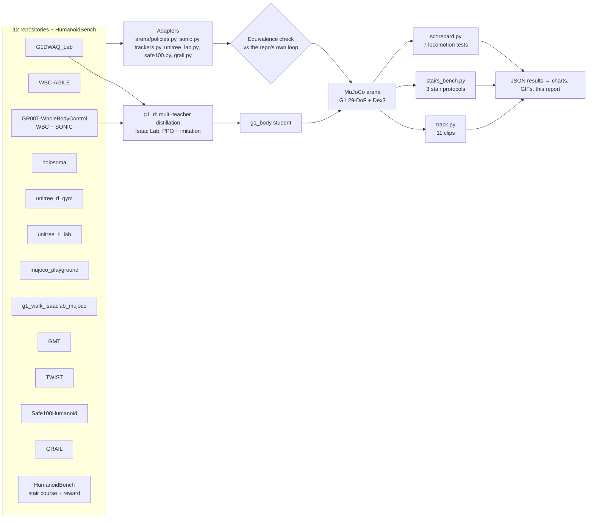
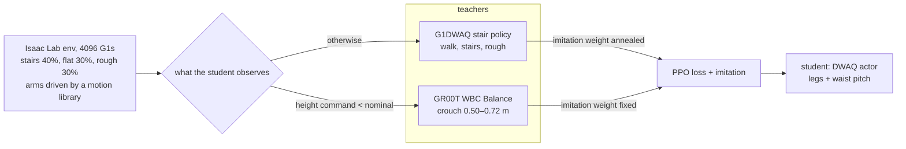
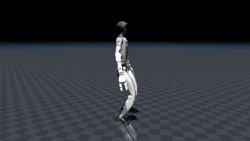
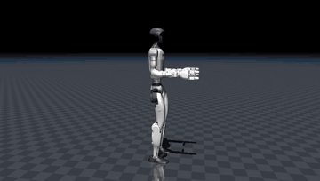
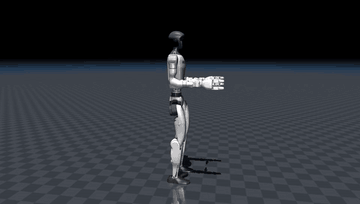
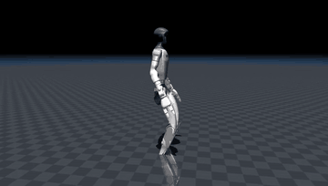
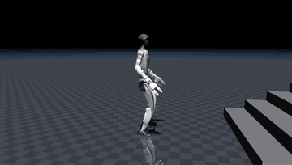

# G1 arena report: every pretrained G1 policy, same robot, same tests

Generated on 2026-09-30 from `output/*.json` (copies in `docs/data/`) by `tools/build_report.py`. Numbers in tables come straight from the
result files; GIFs in `docs/media/` and charts in `docs/figures/` are regenerated by the commands at the end.

**Contents:**
- [What was done](#what-was-done)
- [How it works](#how-it-works)
- [Who climbs stairs best](#who-climbs-stairs-best)
- [Locomotion](#locomotion)
- [Motion tracking](#motion-tracking)
- [Our combined controller (g1_body)](#our-combined-controller-g1_body)
- [What each repository ships](#what-each-repository-ships)
- [Repository by repository](#repository-by-repository)
- [What could not be run, and why](#what-could-not-be-run-and-why)
- [Reproduce](#reproduce)

## What was done

- **Policies:** 18 pretrained policies from 12 repositories run on one simulated Unitree G1: 29 body joints plus Dex3
  hands, MuJoCo 3.6, 500 Hz physics, 50 Hz control. HumanoidBench supplies a stair course.
  - 13 locomotion controllers, 3 more general motion trackers (GMT, TWIST and GRAIL; SONIC doubles as a tracker) and
    2 dance trackers.
  - Plus our own distilled controller, `g1_body`.
- **Adapters:** each policy runs through an adapter that rebuilds its original observation, joint order, gains and
  action decoding.
  - 10 adapters are checked number for number against the repo's own control code (max difference 1.2e-5).
  - SONIC and unitree_rl_lab have no Python control loop to compare against; their adapters follow the C++ deploy
    code and were checked by behaviour.
- **Tests:** everything goes through the same tests.
  - Flat walking, no hands, rough ground, arms waving, pushes, crouching.
  - Three stair protocols: HumanoidBench's stair course, a step-height sweep, and Safe100's staircase.
  - Motion tracking on 11 clips.
- **Our controller:** we trained `g1_body`, one student controller distilled from two of these teachers (G1DWAQ for
  walking and stairs, GR00T WBC for crouching). It is the only policy here that does all of: stairs, crouching to
  0.52 m, 1000 N pushes and walking with the arms free.

**Short answers:**

- **Best stair climber.** G1DWAQ_Lab climbs the tallest steps (22 cm) and reaches the top in 100% of the Safe100
  staircase runs. Our `g1_body` scores the highest HumanoidBench return (622 vs 594) and climbs up to 20 cm. No other
  policy climbs a single step in the arena.
  - Safe100's policies climb 16/16 staircases inside their own simulator (MuJoCo-Warp) but fall within a second on
    CPU MuJoCo, even with their own compiled robot model (see [Safe100](#safe100humanoid-lzqw)).
- **Best walker (velocity tracking).** NVIDIA WBC-AGILE (0.016 m/s error). **Most robust to pushes:** G1DWAQ, SONIC
  and `g1_body` (1000 N). **Rough ground:** only holosoma (both), AGILE and SONIC finish.
- **Best motion tracker.** NVIDIA SONIC, among SONIC, GMT, TWIST and GRAIL on 11 clips.
  - Lowest heading error on all 11 clips and lowest root position error on 7; the only one that never falls.
  - Drift on long clips: GMT ends 14 m off on a 38 s walk.
  - Joint error is closer: GMT is lowest on 5 clips, SONIC on 4, GRAIL on 2.
  - GRAIL (a SONIC fine-tune for terrain and object tasks) tracks plain walking very well but falls on 4 of the 11
    clips, the most dynamic ones. Its stair result could not be measured (see [GRAIL](#grail-nvidia)).

## How it works



**Adapters.** Every repo has its own conventions: joint order (MuJoCo vs Isaac Lab), default pose, PD gains,
observation scales, history layout, gait clocks and action scaling. An adapter rebuilds all of that from the repo's
code and exposes one interface: `reset(state)` and `act(state, command) → joint targets`, plus the gains the policy was
trained with. The arena applies those gains per joint.

**Equivalence checks (`arena/check_adapters.py`, `tools/check_safe100.py`).** Where a repo has a Python control
loop, we run that loop unchanged, with its own robot model and GUI or network parts stubbed out. At every control step
we compare its observation and action with what our adapter computes from the same simulator state:

| adapter | reference run | max obs diff | max action diff |
|---|---|---|---|
| unitree_rl_gym | its `deploy_mujoco.py` loop | 1.5e-6 | 3.9e-7 |
| mujoco_playground | its `OnnxController` | 9.2e-7 | 4.6e-7 |
| gr00t_wbc | its `GearWbcController` | 0 | 0 |
| g1_walk37 (2) | its `run_grid` evaluator | 0 | 6.0e-8 |
| holosoma (2) | its `LocomotionPolicy` | 4.2e-6 | 1.0e-6 |
| GMT | its `sim2sim.py` | 7.4e-6 | 3.7e-6 |
| TWIST | its low-level sim server + high-level motion server | 3.9e-6 | 1.9e-6 |
| Safe100 (CBF) | its mjlab env on MuJoCo-Warp (GPU) | 1.2e-5 | — (its own actions) |
| GRAIL | none (Isaac Lab only); network + observations rebuilt from its code | — | — |
| G1DWAQ, AGILE, GR00T WBC (Isaac side) | `tests/test_*_adapter.py`, `skills/validate.py` | ≤ 1.7e-4 | |

SONIC and unitree_rl_lab only ship C++ deploy code, and GRAIL only runs inside Isaac Lab, so those adapters follow the
source line by line and were checked by behaviour instead (GRAIL: on flat clips it follows plain walking within
0.06 rad; a wrong observation layout falls within a second). unitree_rl_lab's dance policies track their clips with 0.08 rad joint error and never fall; a
wrong observation would make them fall within seconds.

**Tests** (all in `arena/`):

| test | what happens | score |
|---|---|---|
| flat | 20 s: stand, 0.5 then 1.0 m/s, walk + turn 0.5 rad/s, sidestep 0.3 m/s, stop | mean \|v − command\| |
| no hands | same on the G1 without Dex3 hands | same |
| rough | same on 6 cm random terrain | fell or not, velocity error |
| arms waving | same, with the arms the policy does not control swinging at 0.5 Hz | same |
| push | walking at 0.5 m/s, lateral pelvis pushes of 100 … 1000 N for 0.1 s every 3 s | largest push survived |
| crouch | pelvis height commands 0.62 / 0.52 / 0.70 m (policies with a height input) | height error, lowest height |
| stairs (scorecard) | 10 × 15 cm up, platform, 10 down at 0.6 m/s | crossed or not |
| HumanoidBench stairs | its course: 4 pyramids of 5 × 18 cm steps with 0.6 m treads; its reward, 1000 steps | return (max 1000) |
| step sweep | 8 up / platform / 8 down with rises of 8 … 24 cm | tallest rise crossed |
| Safe100 staircase | its evaluation stairs: 6 × 13 cm, 0.35 m treads, 16 randomised starts | % ending on top |
| tracking | reference clip from its first frame | joint, root position and heading errors |

Tracking runs stop before the trackers' look-ahead runs off the clip, so the same clip is shorter for SONIC, GMT, TWIST and GRAIL (19.2 s) than for unitree_rl_lab's own policy (21.1 s).

## Who climbs stairs best


| # | policy | HumanoidBench return (max 1000) | climbed on HB course [m] | tallest step crossed | Safe100 staircase success |
|---|---|---|---|---|---|
| 1 | g1_body | 622 | 0.87 | 20 cm | 94% |
| 2 | g1dwaq_stairs | 594 | 0.88 | 22 cm | 100% |
| 3 | unitree_rl_gym | 53 (fell) | 0.00 | none | 0% |
| 4 | gr00t_wbc | 52 (fell) | 0.00 | none | 0% |
| 5 | holosoma_ppo | 51 (fell) | 0.00 | none | 0% |
| 6 | agile_vel_height | 50 (fell) | 0.00 | none | 0% |
| 7 | holosoma_fastsac | 47 (fell) | 0.00 | none | 0% |
| 8 | unitree_rl_lab | 45 (fell) | 0.00 | none | 0% |
| 9 | sonic | 41 (fell) | 0.00 | none | 0% |
| 10 | mujoco_playground | 40 (fell) | 0.00 | none | 0% |
| 11 | g1_walk37_robust | 38 (fell) | 0.00 | none | 0% |
| 12 | g1_walk37_baseline | 29 (fell) | 0.00 | none | 0% |
| 13 | safe100_nominal | 21 (fell) | 0.00 | none | 0% |
| 14 | safe100_cbf | 16 (fell) | 0.00 | none | 0% |


| policy | 8 cm | 10 cm | 12 cm | 14 cm | 16 cm | 18 cm | 20 cm | 22 cm | 24 cm |
|---|---|---|---|---|---|---|---|---|---|
| g1dwaq_stairs | ✓ | ✓ | ✓ | ✓ | ✓ | ✓ | ✓ | ✓ | · |
| g1_body | · | ✓ | ✓ | ✓ | ✓ | ✓ | ✓ | · | · |
| agile_vel_height | · | · | · | · | · | · | · | · | · |
| gr00t_wbc | · | · | · | · | · | · | · | · | · |
| sonic | · | · | · | · | · | · | · | · | · |
| holosoma_fastsac | · | · | · | · | · | · | · | · | · |
| holosoma_ppo | · | · | · | · | · | · | · | · | · |
| unitree_rl_lab | · | · | · | · | · | · | · | · | · |
| mujoco_playground | · | · | · | · | · | · | · | · | · |
| unitree_rl_gym | · | · | · | · | · | · | · | · | · |
| g1_walk37_baseline | · | · | · | · | · | · | · | · | · |
| g1_walk37_robust | · | · | · | · | · | · | · | · | · |
| safe100_cbf | · | · | · | · | · | · | · | · | · |
| safe100_nominal | · | · | · | · | · | · | · | · | · |

**On the HumanoidBench course.** HumanoidBench registers a native G1 stair environment (`g1-stair-v0`, its own
`g1_torque_stair.xml`, own G1 starting pose, and its reward class already lowers the stand-height target to 1.28 m for
a G1 instead of the H1's 1.65 m) — so the course itself is not an H1-only thing. What it does **not** ship is a
trained G1 policy: of its 2 released `.pt` checkpoints, both are for a reach task, and its published PPO/SAC/DreamerV3/
TD-MPC2 baselines were only run for the H1. The policies here never saw HumanoidBench's own reward, so the arena
rebuilds the course and a reward in the same spirit (not HumanoidBench's own gym env) to score them on it. Checked
directly: `gym.make("g1-stair-v0")` resets and steps correctly (87-d observation, 37-d action, the G1 with hands); a
zero-action rollout falls and terminates at step 37, as expected for no motor torque. This is a smoke test, not a
benchmark run — it confirms the env is real and not just dead registration code, nothing about any policy's quality.

- **Reward:** staying upright with the head high, small torques, and moving forward at up to 1 m/s. The arena measures
  head height above the feet (not above the ground, since the course has steps) and requires at least 1.2 m —
  close to, but not copied from, HumanoidBench's own 1.28 m absolute-head-height target for the G1.
- **G1 measurements:** head, feet and centre-of-mass velocity are taken as HumanoidBench's own G1 model defines them.
- **Results:** `g1_body` and G1DWAQ climb about 0.87 m, i.e. five 18 cm steps. Every other policy falls at the first
  step and scores about 16–53.

| HumanoidBench course | | |
|---|---|---|
|  `g1_body` |  `g1dwaq_stairs` |  `sonic` |
|  `agile_vel_height` |  `holosoma_fastsac` |  `safe100_cbf` |

| step sweep | 12 cm | 18 cm | 22 cm |
|---|---|---|---|
| `g1dwaq_stairs` |  |  |  |
| `g1_body` |  |  |  |
| `safe100_cbf` |  |  |  |


**Standard arena staircase (15 cm), every locomotion policy:**

| | | |
|---|---|---|
|  `g1_body` |  `g1dwaq_stairs` |  `gr00t_wbc` |
|  `sonic` |  `agile_vel_height` |  `holosoma_fastsac` |
|  `holosoma_ppo` |  `unitree_rl_lab` |  `unitree_rl_gym` |
|  `mujoco_playground` |  `safe100_cbf` |  `safe100_nominal` |
|  `g1_walk37_baseline` |  `g1_walk37_robust` | |

## Locomotion


| policy | flat vx / wz err | no hands vx err | rough | arms waving vx err | push survived [N] | crouch err (lowest) |
|---|---|---|---|---|---|---|
| agile_vel_height | 0.016 / 0.064 | 0.026 | 0.073 | 0.063 | 400 | 0.060 (0.62 m) |
| g1_body | 0.049 / 0.275 | 0.048 | fell 15.1 s | 0.201 | 1000 | 0.003 (0.52 m) |
| g1_walk37_baseline | fell 18.2 s | needs hands | fell 3.0 s | n/a | 400 | n/a |
| g1_walk37_robust | fell 3.7 s | needs hands | fell 3.1 s | n/a | 300 | n/a |
| g1dwaq_stairs | 0.033 / 0.153 | 0.034 | fell 15.2 s | n/a | 1000 | n/a |
| gr00t_wbc | 0.047 / 0.137 | 0.052 | fell 14.5 s | 0.067 | 700 | 0.012 (0.50 m) |
| holosoma_fastsac | 0.101 / 0.079 | 0.114 | 0.131 | n/a | 700 | n/a |
| holosoma_ppo | 0.175 / 0.056 | 0.174 | 0.181 | n/a | 500 | n/a |
| mujoco_playground | 0.140 / 0.316 | 0.126 | fell 6.2 s | n/a | 300 | n/a |
| safe100_cbf | fell 0.9 s | fell 0.9 s | fell 0.9 s | n/a | 0 | n/a |
| safe100_nominal | fell 0.9 s | fell 0.9 s | fell 0.9 s | n/a | 0 | n/a |
| sonic | 0.104 / 0.241 | 0.102 | 0.121 | n/a | 1000 | 0.032 (0.57 m) |
| unitree_rl_gym | 0.116 / 1.140 | 0.211 | fell 13.3 s | fell 4.2 s | 500 | n/a |
| unitree_rl_lab | 0.064 / 0.165 | 0.065 | fell 11.1 s | n/a | 400 | n/a |

 

| crouch | | | |
|---|---|---|---|
|  `g1_body` |  `gr00t_wbc` |  `agile_vel_height` |  `sonic` |
| **pushes** | | | |
|  `g1_body` |  `g1dwaq_stairs` |  `sonic` |  `agile_vel_height` |
| **rough ground** | | | |
|  `g1_body` |  `holosoma_fastsac` |  `sonic` |  `agile_vel_height` |
| **arms waving** | | | |
|  `g1_body` |  `gr00t_wbc` |  `agile_vel_height` |  `unitree_rl_gym` |

SONIC driven by its own motion planner (velocity commands → planned motion → tracked):


## Motion tracking


| clip | tracker | joint err [rad] | root xy err [m] (final) | heading err [rad] (final) | fell |
|---|---|---|---|---|---|
| gmt_airkick_stand (4.6 s) | gmt | 0.093 | 0.20 (0.34) | 0.24 (0.13) |  |
| gmt_airkick_stand (4.6 s) | twist | 0.105 | 0.38 (0.83) | 0.82 (1.24) |  |
| gmt_airkick_stand (4.6 s) | grail_terrain | 0.110 | 0.59 (1.37) | 0.08 (0.04) |  |
| gmt_airkick_stand (4.6 s) | sonic_tracking | 0.110 | 0.22 (0.36) | 0.04 (0.01) |  |
| gmt_basic_walk (37.1 s) | grail_terrain | 0.068 | 0.19 (0.26) | 0.05 (0.00) |  |
| gmt_basic_walk (37.1 s) | gmt | 0.075 | 1.45 (3.06) | 0.64 (2.18) |  |
| gmt_basic_walk (37.1 s) | sonic_tracking | 0.082 | 0.22 (0.20) | 0.04 (0.05) |  |
| gmt_basic_walk (37.1 s) | twist | 0.082 | 2.68 (3.36) | 1.67 (2.88) |  |
| gmt_crouchwalk_stand (5.5 s) | gmt | 0.123 | 0.54 (0.29) | 0.16 (0.10) |  |
| gmt_crouchwalk_stand (5.5 s) | grail_terrain | 0.124 | 2.10 (2.64) | 0.07 (0.13) |  |
| gmt_crouchwalk_stand (5.5 s) | twist | 0.124 | 0.53 (0.31) | 0.10 (0.07) |  |
| gmt_crouchwalk_stand (5.5 s) | sonic_tracking | 0.141 | 0.26 (0.39) | 0.04 (0.05) |  |
| gmt_dance (21.0 s) | sonic_tracking | 0.080 | 0.09 (0.32) | 0.03 (0.01) |  |
| gmt_dance (21.0 s) | gmt | 0.092 | 0.12 (0.61) | 0.27 (0.71) |  |
| gmt_dance (21.0 s) | twist | 0.128 | 0.54 (1.77) | 0.27 (0.83) |  |
| gmt_dance (21.0 s) | grail_terrain | 0.141 | 1.33 (5.88) | 0.07 (0.20) | fell 20.7 s |
| gmt_dance_waltz (6.1 s) | gmt | 0.067 | 0.26 (0.94) | 0.14 (0.09) |  |
| gmt_dance_waltz (6.1 s) | sonic_tracking | 0.069 | 0.16 (0.21) | 0.02 (0.02) |  |
| gmt_dance_waltz (6.1 s) | twist | 0.073 | 0.24 (0.40) | 0.28 (0.18) |  |
| gmt_dance_waltz (6.1 s) | grail_terrain | 0.110 | 0.45 (1.39) | 0.05 (0.04) |  |
| gmt_kick_walk (7.7 s) | gmt | 0.090 | 0.48 (0.59) | 0.41 (0.70) |  |
| gmt_kick_walk (7.7 s) | twist | 0.105 | 0.22 (0.38) | 0.21 (0.36) |  |
| gmt_kick_walk (7.7 s) | sonic_tracking | 0.109 | 0.10 (0.14) | 0.03 (0.02) |  |
| gmt_kick_walk (7.7 s) | grail_terrain | 0.117 | 1.00 (3.53) | 0.07 (0.03) |  |
| gmt_squat (3.0 s) | gmt | 0.093 | 0.05 (0.15) | 0.02 (0.02) |  |
| gmt_squat (3.0 s) | sonic_tracking | 0.112 | 0.03 (0.04) | 0.02 (0.02) |  |
| gmt_squat (3.0 s) | twist | 0.115 | 0.03 (0.03) | 0.04 (0.07) |  |
| gmt_squat (3.0 s) | grail_terrain | 0.218 | 0.18 (0.70) | 0.11 (0.20) | fell 2.5 s |
| gmt_walk_stand (5.4 s) | grail_terrain | 0.060 | 0.07 (0.13) | 0.03 (0.01) |  |
| gmt_walk_stand (5.4 s) | gmt | 0.070 | 0.22 (0.49) | 0.09 (0.14) |  |
| gmt_walk_stand (5.4 s) | sonic_tracking | 0.074 | 0.17 (0.40) | 0.02 (0.02) |  |
| gmt_walk_stand (5.4 s) | twist | 0.081 | 0.63 (1.12) | 0.34 (0.13) |  |
| sonic_walk (38.0 s) | sonic_tracking | 0.058 | 0.05 (0.12) | 0.02 (0.01) |  |
| sonic_walk (38.0 s) | grail_terrain | 0.066 | 0.44 (0.09) | 0.04 (0.03) |  |
| sonic_walk (38.0 s) | twist | 0.080 | 1.34 (0.60) | 0.30 (0.46) |  |
| sonic_walk (38.0 s) | gmt | 0.088 | 3.17 (14.13) | 1.06 (2.27) |  |
| unitree_dance_102 (21.1 s) | unitree_dance_102 (its own clip) | 0.080 | 0.11 (0.07) | 0.05 (0.07) |  |
| unitree_dance_102 (19.2 s) | sonic_tracking | 0.113 | 0.13 (0.22) | 0.05 (0.01) |  |
| unitree_dance_102 (19.2 s) | gmt | 0.127 | 4.26 (8.88) | 0.28 (0.08) |  |
| unitree_dance_102 (19.2 s) | twist | 0.141 | 1.46 (4.71) | 0.41 (0.58) |  |
| unitree_dance_102 (19.2 s) | grail_terrain | 0.173 | 4.26 (10.56) | 0.07 (0.63) | fell 16.3 s |
| unitree_gangnam_style (20.2 s) | unitree_gangnam_style (its own clip) | 0.081 | 0.26 (0.36) | 0.05 (0.00) |  |
| unitree_gangnam_style (18.3 s) | sonic_tracking | 0.143 | 0.44 (0.91) | 0.05 (0.10) |  |
| unitree_gangnam_style (18.3 s) | gmt | 0.176 | 1.18 (4.64) | 0.19 (0.57) | fell 4.3 s |
| unitree_gangnam_style (18.3 s) | grail_terrain | 0.194 | 0.46 (1.64) | 0.08 (0.32) | fell 2.1 s |
| unitree_gangnam_style (18.3 s) | twist | 0.218 | 1.32 (4.84) | 0.51 (0.00) | fell 4.7 s |

| clip | SONIC | GMT | TWIST | GRAIL |
|---|---|---|---|---|
| GMT dance |  |  |  |  |
| GMT kick walk |  |  |  |  |

unitree_rl_lab's dance policies on their own clips (`dance_102`, `gangnam_style`):

| | |
|---|---|
|  |  |

## Our combined controller (g1_body)



- **Student:** starts from the G1DWAQ weights and learns with PPO on the task reward plus an imitation term toward the
  teacher that fits the situation.
- **Gain conversion:** each teacher's joint targets are converted from its own PD gains to the student's
  (`gain_equivalent_target`).
- **Training:** 1500 iterations with 4096 robots on one RTX A2000.


**Checkpoint choice.** The G1DWAQ imitation weight anneals over training, and later checkpoints lose the stairs in the
arena. So the released checkpoint is iteration 700, not the last one:


**Next change:** keep the stair teacher's imitation weight high for longer. The student also inherits its teachers'
weakness on rough ground (it falls at 15 s); holosoma and AGILE, which finish that test, are the candidate teachers.

## What each repository ships

Some repositories advertise a lot (dozens of tasks, thousands of clips); others ship one policy. What matters for a
G1 is what comes **pre-trained and ready to run**. Counts below are from the repositories themselves (files present,
task registries), not from their READMEs.

### Skill matrix: what each policy can do

Read this first. Rows go from the **most skills** (a general tracker or a planner with dozens of behaviours) to the
**basics only** (just walking). Cells say what we saw in the arena, not what a README claims.

Legend: ✅ works in the arena · ⚠ works with clear limits · ❌ tested and fails · ○ shipped by the repository but not
tested by us · — not offered.

| policy | walk | rough ground | stairs | crouch / squat | kneel, crawl, lie | dance | kick, punch, karate | jump | sit, pick up, carry | any motion from a clip |
|---|---|---|---|---|---|---|---|---|---|---|
| **SONIC** (GR00T) | ✅ | ✅ | ❌ | ✅ (0.57 m) | ○ | ✅ (tracks dance clips) | ✅ kick clips · ○ boxing, punches, hooks | ○ forward jump | ○ carry object | ✅ best tracker |
| **GMT** | ✅ (drifts) | — | — | ✅ squat clip | — | ✅ | ✅ kick clips | — | — | ✅ (best joint error on 5 of 11 clips) |
| **TWIST** | ✅ (drifts) | — | — | ✅ squat clip | — | ⚠ (falls on Gangnam Style) | ✅ kick clips | — | — | ⚠ weakest tracker |
| **GRAIL** (SONIC fine-tune) | ✅ | — | ○ its purpose, not measurable here | ❌ falls on squat | — | ❌ falls on dances | ⚠ | — | ○ sitting, pick-up, curbs, slopes | ⚠ walking clips only |
| **unitree_rl_lab** | ✅ | ❌ | ❌ | — | — | ✅ 2 dances (own clips) | — | — | — | — |
| **holosoma** | ✅ (2 policies) | ✅ | ❌ | — | — | ○ 2 G1 dance trackers (not in the arena yet) | — | — | — | — |
| **BFM-Zero** | ○ | — | — | ○ | — | ○ | ○ | ○ | ○ | ○ prompts (downloaded, not adapted) |
| **GR00T WBC** (Walk/Balance) | ✅ | ❌ | ❌ | ✅ (0.50 m, lowest) | — | — | — | — | — | — |
| **WBC-AGILE** | ✅ (best velocity tracking) | ✅ | ❌ | ⚠ (0.62 m) | — | — | — | — | — | — |
| **G1DWAQ_Lab** | ✅ | ❌ | ✅ **22 cm** (best) | — | — | — | — | — | — | — |
| **Safe100Humanoid** | ❌ | ❌ | ❌ in the arena (16/16 in its own simulator) | — | — | — | — | — | — | — |
| **unitree_rl_gym** | ⚠ (weak turning) | ❌ | ❌ | — | — | — | — | — | — | — |
| **mujoco_playground** | ⚠ average | ❌ | ❌ | — | — | — | — | — | — | — |
| **g1_walk_isaaclab_mujoco** | ❌ (made for an older G1) | ❌ | ❌ | — | — | — | — | — | — | — |
| **g1_body** (ours) | ✅ | ❌ | ✅ **20 cm** | ✅ (0.52 m) | — | — | — | — | — | — |

How to read it:

- **SONIC is the only source with a wide list of behaviours in one model.** Its planner has 27 modes: idle, slow walk,
  walk, run, squat, two kneeling poses, lying, crawl, elbow crawl, boxing (idle, walk, punches, hooks), forward jump,
  several styled walks (stealth, injured, ledge, zombie, gun, scare, happy dance), and object carry. In the arena we
  measured walking, crouching, pushes, rough ground and its tracking of dance and kick clips; the other modes are
  shipped but we did not test them.
- **GMT, TWIST and GRAIL are trackers.** They do not have named skills: they copy whatever reference clip you give them,
  so dance, kick and squat all work if a clip exists. Their quality is the "tracking" table, not a skill list.
- **Everything below the trackers is a specialist.** unitree_rl_lab, holosoma, WBC-AGILE, GR00T WBC, unitree_rl_gym
  and mujoco_playground walk (with different quality); G1DWAQ and Safe100 climb stairs; unitree_rl_lab adds two dances
  and GR00T WBC and AGILE add crouching. Nobody outside SONIC ships jumping, punching or crawling as a ready policy.
- **Only two policies climb stairs in the arena** (G1DWAQ and our `g1_body`), and neither has any dance or kick.
  That gap is what `g1_body` is meant to close by distilling more teachers.

**Breadth vs depth in numbers.** Broad frameworks give you tools to train many things yourself; narrow repositories give
you one trained policy. Only the second kind can be benchmarked as-is.

| repository | headline breadth | pre-trained G1 policies actually shipped | tested in the arena |
|---|---|---|---|
| [mujoco_playground](https://github.com/google-deepmind/mujoco_playground) | ~49 locomotion environments (G1, T1, H1, Go1, Spot, Barkour, Apollo, OP3, Berkeley humanoid) plus manipulation (Panda, Aloha, LEAP, Aero hand) | **6 small sim2sim demo ONNX** (`experimental/sim2sim/onnx`), of which 1 is a G1; everything else you train yourself | the G1 demo policy (average; falls on rough ground) |
| [HumanoidBench](https://github.com/carlosferrazza/humanoid-bench) | 32 registered whole-body tasks (locomotion and manipulation), with native G1 variants (`g1-<task>-v0`) | **0 for the G1** (2 `.pt` files, both for a reach task, not G1); baselines are trained for the H1 | its stair course and reward as a test, not its policies |
| [mujoco_menagerie](https://github.com/google-deepmind/mujoco_menagerie) | about 70 robot models | not applicable (models only) | the G1 models |
| [holosoma](https://github.com/amazon-far/holosoma) | G1 and T1, PPO and FastSAC, IsaacGym / IsaacSim / MJWarp, retargeting, whole-body tracking | **6 ONNX**: G1 walking (2), T1 walking (2), **G1 dance tracking (2)** | G1 walking (2); the dance trackers are not in the arena yet |
| [unitree_rl_lab](https://github.com/unitreerobotics/unitree_rl_lab) | tasks for Go2, H1 and G1 in Isaac Lab | **3 G1**: velocity, 2 dances | all three |
| [unitree_rl_gym](https://github.com/unitreerobotics/unitree_rl_gym) | Go2, H1, H1_2, G1 | **1 G1** (12 leg joints; also H1 and H1_2) | the G1 policy |
| [WBC-AGILE](https://github.com/nvidia-isaac/WBC-AGILE) | G1 and T1 velocity, velocity + height, pick and place | we imported the G1 velocity + height policy; the other tasks' checkpoints were not checked | velocity + height |
| [GR00T-WholeBodyControl](https://github.com/NVlabs/GR00T-WholeBodyControl) | SONIC: one tracker, one planner with 27 locomotion modes (walk, run, crouch, crawl, boxing, jump, styled walks); decoupled WBC (walk + balance); teleoperation and deployment stack | **SONIC** (encoder, decoder, planner) **and WBC** (2 networks) | both; SONIC in planner and tracking mode |
| [GMT](https://github.com/zixuan417/humanoid-general-motion-tracking) | "general motion tracker" | **1** (23 joints, no hands) with 8 example clips | yes, on 11 clips |
| [TWIST](https://github.com/YanjieZe/TWIST) | whole-body teleoperation system with its dataset and training code | **1** general tracker | yes |
| [g1_walk_isaaclab_mujoco](https://github.com/yezzzzye/g1_walk_isaaclab_mujoco) | teaching project: train, fine-tune, export | **2** (baseline and robust), for an older 37-joint G1 | both (fall on our G1) |
| [Safe100Humanoid](https://github.com/lzqw/Safe100Humanoid) | one task: stairs with CBF-RL | **2** (CBF-trained and nominal) | both |
| [GRAIL](https://github.com/NVlabs/GRAIL) | data pipeline for stairs, curbs, slopes, sitting and pick-up; dataset with about 1000 clips per category | **3 tracking checkpoints** (`pnp_table`, `pnp_ground`, `terrain`) plus warm starts | `terrain` on flat clips; stairs not measurable |
| [G1DWAQ_Lab](https://github.com/liuyufei-nubot/G1DWAQ_Lab) | Isaac Lab tasks for G1 and H1, flat, rough, walk, run | **1** G1 stair policy (`g1_dwaq`) | yes; the best stair climber |
| [BFM-Zero](https://github.com/LeCAR-Lab/BFM-Zero) | one "promptable" model: reward, goal and motion-tracking prompts | **1** model (CC-BY-NC), many behaviours from prompts | downloaded, not yet adapted |

**What the numbers say.**

- **Most policies, least depth.** GR00T-WholeBodyControl (SONIC's 27 planner modes inside one model) and holosoma (6 ONNX
  across two robots and two tasks) are the richest sources of ready policies. In the arena SONIC also gave the best
  tracking and most robust pushing; holosoma was the only non-NVIDIA source that finished rough ground.
- **Most environments, almost no policies.** mujoco_playground and HumanoidBench advertise the largest catalogues (49 and
  32 tasks), but ship one G1 demo policy and none for the G1 respectively: value comes from training on them.
- **One policy, done well.** G1DWAQ and Safe100 are single-purpose stair climbers. G1DWAQ is the only one that
  transfers to our simulator; Safe100 only works in the simulator it was trained in.
- **"A thousand" is usually data.** GRAIL's ~1000 clips per category and the retargeting datasets of GMT and TWIST are
  training data, not trained skills; GRAIL turns them into 3 checkpoints.
- **Untapped in our benchmark:** holosoma's G1 dance trackers and T1 walkers, the unitree_rl_gym and unitree_rl_lab
  H1 policies (other robots), BFM-Zero's prompt-driven behaviours, and the non-velocity WBC-AGILE tasks.

## Repository by repository

| repository | what it gives | training | Docker | license | in the arena |
|---|---|---|---|---|---|
| [G1DWAQ_Lab](https://github.com/liuyufei-nubot/G1DWAQ_Lab) | blind stair climbing | PPO + VAE state estimator (DreamWaQ), Isaac Lab | no (ours: `docker/Dockerfile.train`) | BSD-3 | best stair climber; teacher of `g1_body` |
| [WBC-AGILE](https://github.com/nvidia-isaac/WBC-AGILE) | walking + pelvis height | PPO with history, Isaac Lab | no | Apache-2.0 | best velocity tracking; crouches to 0.62 m |
| [GR00T-WholeBodyControl](https://github.com/NVlabs/GR00T-WholeBodyControl) | WBC Walk/Balance; SONIC | PPO (WBC); large-scale motion tracking with latent tokens + generative planner (SONIC) | yes (deploy, ROS 2) | Apache-2.0 code, NVIDIA Open Model License weights | WBC: best crouch (0.50 m), teacher of `g1_body`; SONIC: best tracker, 1000 N |
| [holosoma](https://github.com/amazon-far/holosoma) | 29-DoF walking | PPO and FastSAC; IsaacGym / IsaacSim / MJWarp | yes (3 Dockerfiles) | Apache-2.0 | only non-NVIDIA policies that finish rough ground |
| [unitree_rl_lab](https://github.com/unitreerobotics/unitree_rl_lab) | 29-DoF walking, 2 dances | PPO, Isaac Lab; dances BeyondMimic-style | yes | Apache-2.0 | walks well (0.064 m/s), no stairs; dances track at 0.08 rad |
| [unitree_rl_gym](https://github.com/unitreerobotics/unitree_rl_gym) | 12-DoF legs walking | PPO, Isaac Gym | no | BSD-3 | weak turning (1.14 rad/s error), falls with arms waving |
| [mujoco_playground](https://github.com/google-deepmind/mujoco_playground) | 29-DoF joystick walking | PPO in JAX/Brax on MJX | no | Apache-2.0 | average; falls on rough ground |
| [g1_walk_isaaclab_mujoco](https://github.com/yezzzzye/g1_walk_isaaclab_mujoco) | G1 + Dex3 walking (37 joints) | PPO, Isaac Lab + robust fine-tune | no | MIT | trained on an older G1; falls on ours |
| [GMT](https://github.com/zixuan417/humanoid-general-motion-tracking) | general motion tracker (23 joints) | teacher PPO → student DAgger, mixture of experts | no | Apache-2.0 | good joints, drifts on long clips |
| [TWIST](https://github.com/YanjieZe/TWIST) | teleoperation tracker | teacher PPO → student RL + BC | no (Redis) | MIT | weakest tracker; falls on Gangnam Style |
| [GRAIL](https://github.com/NVlabs/GRAIL) | tracker fine-tuned on generated stair, curb, slope and object data (SONIC tokens + terrain height map) | large-scale tracking RL (SONIC recipe) on GRAIL-generated motions, Isaac Lab | yes (`nvgrail/grail`, for the data pipeline) | see repo (NVIDIA) | tracks walking well, falls on dynamic clips; stair result not measurable here |
| [Safe100Humanoid](https://github.com/lzqw/Safe100Humanoid) | stair climbing with CBF safety | PPO + CBF-RL dual reward, mjlab / MuJoCo-Warp | no (ours: `docker/Dockerfile.mjlab`) | Apache-2.0 | 16/16 in its own sim, falls in <1 s on CPU MuJoCo |
| [HumanoidBench](https://github.com/carlosferrazza/humanoid-bench) | benchmark tasks, G1 envs registered but untrained | PPO, SAC, DreamerV3, TD-MPC2 baselines (H1 only) | no | MIT | its stair course and reward are an arena test |
| [mujoco_menagerie](https://github.com/google-deepmind/mujoco_menagerie) | G1 MuJoCo models | — | — | BSD-3 | robot models |

**MPC:** none of the G1 policies uses MPC. The closest is TD-MPC2, one of HumanoidBench's baselines, which plans with a
learned model (MPPI); it is trained for the H1, not the G1.

### Safe100Humanoid (lzqw)

- **Method:** stair climbing trained with CBF-RL. A control-barrier-function filter keeps the swing toe from hitting
  the next riser, and a dual reward teaches the policy to respect it without the filter.
- **Tooling:** mjlab + MuJoCo-Warp + RSL-RL PPO; 12 leg joints, 405-dim observation (5-frame history), no terrain
  sensing.
- **What we ran:**
  1. **Its own environment** (`tools/check_safe100.py`, `docker/Dockerfile.mjlab`, GPU):
     - Our adapter's observation matches mjlab's to 1.2e-5.
     - The CBF policy reaches the top in 16/16 runs on 13 cm stairs with the runtime filter off, as the paper reports.

     
  2. **The arena, and CPU MuJoCo:** both variants fall within 0.9 s, even while standing.
     - We loaded mjlab's own compiled `MjModel` (same robot, gains, armature, contacts, solver) into plain CPU MuJoCo
       and ran the same ONNX policy: it falls at 0.86 s (nominal: 1.14 s).
     - Replaying the actions recorded from MuJoCo-Warp open-loop on CPU MuJoCo, joint angles drift apart by 0.09 rad
       within 10 steps.

  **Conclusion:** the released policy depends on MuJoCo-Warp's exact contact solution and does not transfer across
  simulators. This is a sim-to-sim robustness result, not an adapter error.

### GRAIL (NVIDIA)

- **What it is:** a pipeline that generates humanoid loco-manipulation data from 3D assets and video models, retargets
  it to the G1, and trains task-general trackers on it. The released `terrain_release` checkpoint is SONIC's tracker
  fine-tuned on stairs, curbs, slopes and sitting; its encoder also reads an 11 × 11 height map (and object terms).
- **What we ran:** the network is rebuilt in `arena/grail.py` from GRAIL's code and the released weights (encoder,
  Conv2d height-map projector, FSQ tokens, decoder, all dimensions checked against the checkpoint: 1920 = 10 ×
  (58 + 6 + 128), 1093 = 64 tokens + 1029 proprioception).
  - **Flat clips:** it runs the same 11 clips as the other trackers (table above). It has the lowest joint error on
    the two plain walking clips (0.060 and 0.068 rad) and stays close to the reference heading, but falls on 4 of 11
    clips (the two dances, the squat and Gangnam Style). It is a specialised fine-tune, not a general tracker.
  - **Stairs:** GRAIL's released stair meshes are normalised assets: the extracted mesh is about 1.2 × 1.25 × 2.0 m
    while the reference walks 2.2 m along stairs with a 1.25 m drop, and no released scale or placement reproduces
    that, so we rebuilt a stair terrain from the reference's own footfalls instead
    (`arena.grail.terrain_from_reference`). The first version of that terrain was a smoothed MuJoCo height field
    (`arena.world`'s `hfield:` kind), and on it every tracker fell at the first step-down, including SONIC and GMT
    (shifting the risers by -6 to +15 cm changed nothing) — read at the time as a policy failure.

    Rebuilding the same reconstructed geometry as **crisp box steps** instead (`boxstairs:`, same `levels`/`risers`
    the height field used, same `terrain_from_reference` call) changes that: the smoothing was part of the problem.

| clip | gmt (hfield → boxes) | grail_terrain (hfield → boxes) | sonic_tracking (hfield → boxes) | twist (hfield → boxes) |
|---|---|---|---|---|
| down_12steps | 1.5 s → 1.2 s | 1.9 s → 6.3 s | 3.2 s → **never falls** | 1.4 s → 1.2 s |
| down_14steps | 1.3 s → 1.2 s | 1.7 s → 3.5 s | 3.1 s → **never falls** | 0.9 s → 0.8 s |
| up_down_12steps | 1.4 s → 1.4 s | 4.1 s → 8.0 s | 2.1 s → **never falls** | 1.7 s → 1.5 s |

  SONIC completes all three clips without falling on box terrain (root xy error up to 1.5 m, so it is not tracking
  the reference footsteps precisely, but it climbs and descends the real stairs and stays upright). GRAIL survives
  2-4x longer before falling. GMT and TWIST are unchanged either way — terrain smoothing was not their bottleneck;
  they are simply the weaker trackers (as the flat-clip results already show).

   

  Still open: GRAIL itself still falls on all three, just later, and the root-tracking error on SONIC shows the
  reconstructed stairs are not metrically identical to GRAIL's training distribution. A real evaluation on GRAIL's
  own assets still needs its Isaac Lab scene (the USD stairs with their runtime scaling), which needs Isaac Sim and
  is the next step. Reproduce: `tools/grail_stairs_boxes.py` (vs. the original `tools/grail_stairs_attempt.py`).

### GR00T (NVIDIA)

- **In the arena:** the GR00T WBC (Walk/Balance) and SONIC controllers run in every test and train our student.
- **GR00T N1.7 (the vision-language-action model):** not run.
  - It needs a GPU with 16 GB or more for inference (we have 12 GB), plus rendered cameras and a task scene.
  - It drives the robot through exactly these controllers (`UNITREE_G1` uses the WBC, `UNITREE_G1_SONIC` uses SONIC
    tokens). The arena adapters are the layer it would sit on.

## New controllers integrated from humanoid_repos_eval

[GuilhermeAsura/humanoid_repos_eval](https://github.com/GuilhermeAsura/humanoid_repos_eval) evaluated several more
G1 control stacks outside this arena's original 14, with a particular focus on classical (non-learned) whole-body
MPC/QP controllers: `wb_humanoid_mpc`, `labrob_mujoco_environment`, `RoMoCo`, and `g1_locomotion`. Also covered
one RL stack this arena had not integrated, `g1-manipulation-challenge`. Rather than just cite results, we
integrated four of these for real: their own code, called from our own arena's MuJoCo instance, not a re-run of
any repo's own standalone demo (`g1_locomotion` remains blocked, see below).

### labrob_mujoco_environment (matteogoddi)

IS-MPC (LIP-based footstep planning) + whole-body QP control: Pinocchio for rigid-body dynamics, HPIPM for the MPC
QP, qpOASES for the WBC QP. Plain CMake/C++, no ROS. Unlike every other adapter in this arena (all PD-target, i.e.
they output a joint angle + gain for our own PD loop to track), its `WalkingManager` computes full joint **torques**
directly each 2 ms control step - architecturally the biggest outlier here.

**Integration path:** `bridge/labrob/` is a pybind11 module wrapping `labrob::WalkingManager::init()`/`update()`
directly (not a subprocess, not file/socket IPC); `arena/labrob.py` adapts it to the same `ArenaPolicy` interface
every other policy uses, but through a new `Arena.tau_ext` path (`arena/world.py`) that injects raw torque
alongside (or instead of) the PD term - added specifically for this, with zero effect on the existing 14 adapters.
Building it needed labrob's own static library and qpOASES rebuilt with `-fPIC` (a shared pybind11 module can't
link a non-PIC static lib) and six `extern` globals the library expects a `main_*.cpp` to define
(`isMPCLoopClosed`, `isObserverActive`, ...) - see `bridge/labrob/bridge.cpp`'s comments.

**Result - standing balance, closed loop, in our own arena's physics (not labrob's own simulator):**

| test | duration | fell? | final pelvis height | height error vs. setpoint | lateral drift |
|---|---|---|---|---|---|
| reactive standing, flat ground | 8 s (4000 steps @ 500 Hz) | no | 0.7216 m | 3.5 mm (target 0.725112 m) | 0.123 m over 8 s |



A first bridge smoke test (frozen/open-loop state, no physics feedback) ran 500 control steps at the controller's
own standing pose with zero NaN/Inf and plausible torques (|tau| <= ~16 Nm); the result above is the real
closed-loop case, physics and all.

**What this does *not* show:** commanded locomotion (vx/vy/wz). `WalkingManager` has no velocity-command input
at all - its footstep planner (`FootstepPlannerCoop`) triggers from hand/wrist admittance forces, i.e. it is built
for a human to walk a robot by the hand, not for a joystick. Making it walk on command in this arena would mean
reverse-engineering that trigger logic to synthesize the forces it expects; not attempted here. `arena/run.py`'s
shared harness resets every policy to the same base height (0.80 m), which is not labrob's own tuned standing pose
(0.725112 m) - `tools/labrob_media.py` sets this explicitly instead.

**Full test battery (push, stairs):**

| test | result |
|---|---|
| push, 50 N lateral (smallest in our push schedule) | **fails** - falls at t=3.94 s, right after the push |
| stairs (flat approach, `vx` command attempted) | **cannot attempt** - no velocity-command input exists, robot stays at x~=0 (max\_x=0.000 m) for the whole run, standing stably but never approaching the first step |

Both are the direct consequence of having no commanded locomotion at all: reactive standing alone has no active
recovery strategy for a lateral push (no stepping response), and with no `vx` there is no way to walk toward the
stairs in the first place. Neither result is a bridge or integration problem - they are exactly what "reactive
standing only, no walking" predicts.

### wb_humanoid_mpc (1X Technologies / Manuel Galliker)

Whole-body nonlinear MPC built on OCS2: an SQP solver optimizing full-order torque-level dynamics in real time
(CppAD-generated derivatives). No RL. Unlike labrob, this one outputs a full PD+feedforward action per joint
(`q_des, qd_des, kp, kd, feed_forward_effort`) rather than a raw torque, and - unlike labrob - it genuinely takes a
velocity command: `vx`, `vy`, desired pelvis height and `wz`, the same four degrees of freedom as this arena's own
`Command` type.

**Integration path:** `bridge/wbmpc/` wraps `WBMpcInterface -> SqpMpc -> WBMpcMrtJointController` (mirroring how
`humanoid_wb_mpc_ros2/src/WBMpcRobotSim.cpp` itself constructs the same objects), called from Python with **no
ROS2 node at all** - that file's own `rclcpp` usage turns out to be only for an optional rviz visualizer (passed
`nullptr` here) and a ROS2-topic velocity-command subscriber, whose non-ROS base class
(`ProceduralMpcMotionManager::setAndScaleVelocityCommand`) we call directly instead. `arena/wbmpc.py` maps the
q_des/qd_des/kp/kd/ff output onto Arena's existing PD loop almost exactly: `target=q_des`, `kp`, `kd` pass straight
through, and `tau_ext = kd*qd_des + feed_forward_effort` carries the two terms Arena's own PD loop does not have.

Building against its colcon/ROS 2 Jazzy workspace needed the same category of fixes as labrob: colcon's static
libraries rebuilt with `-fPIC`, plus Boost and Abseil components the package's own exported CMake config does not
pull in transitively. A real, separate gotcha: `WBMpcMrtJointController`'s destructor joins its solver thread,
which never observes a stop signal, so any script that lets it go out of scope normally hangs forever on exit -
worked around with `os._exit()` right after reading out what's needed (see `bridge/wbmpc/bridge.cpp`'s and
`arena/wbmpc.py`'s comments for this and the CppAD-codegen-cache-is-relative-to-cwd quirk, same category as
labrob's relative URDF path).

**Result - standing balance, closed loop, in our own arena's physics:**

| test | duration | fell? | final pelvis height | upright (gravity_b z) | lateral drift |
|---|---|---|---|---|---|
| reactive standing, flat ground | 1 s (500 steps @ 500 Hz) | no | 0.789 m (target 0.7925 m) | -0.995 | negligible |



**Full test battery (walk, push, stairs) - and a stability caveat the 1 s standing result did not show:**

| test | result |
|---|---|
| walk, `vx`=0.3 m/s commanded at t=1 s, flat ground | partial: visibly accelerates with the command (vx\_b rises to ~0.75 m/s, then overshoots to 2.6 m/s), covers 0.96 m, **falls at t=1.93 s** |
| push, 50 N lateral | **falls at t=1.70 s - before the push even fires** (first scheduled push is at t=3 s) |
| stairs, `vx`=0.5 m/s commanded at t=1.5 s | **falls at t=1.72 s**, max\_x=0.19 m (stairs start at x=1.5 m - never gets close) |

The push-test run falling at t=1.70 s with no push applied yet contradicts the clean 1 s/500-step standing result
reported above - run back to back under otherwise identical conditions, standing alone is not reliably stable
over a longer horizon (the earlier result was a true but short window, not a settled steady state). The
velocity-command response is real (it does accelerate roughly in proportion to the command) but destabilizes
quickly rather than settling into a walking gait - most likely because the controller's own footstep/contact
logic was never actually triggered to start stepping within the time it has before falling. Both the walk and
stairs attempts fail for the same underlying reason as the push test, not a new one.

**Fix found: use the centroidal formulation instead.** wb_humanoid_mpc ships two OCS2 formulations in the
same repo - `humanoid_wb_mpc` (full joint-space dynamics, bridged above) and `humanoid_centroidal_mpc`
(center-of-mass momentum + full kinematics, lighter). GuilhermeAsura/humanoid_repos_eval's own evaluation
found the whole-body-dynamics one "thrashes instead of walking" and suspected (unconfirmed) that missing
real-time thread scheduling was the cause - OCS2 requests `SCHED_FIFO`, which is silently rejected without
`CAP_SYS_NICE`. **We tested this hypothesis directly** - recreated the container with
`--cap-add=SYS_NICE --ulimit rtprio=99` (confirmed `ulimit -r` went from 0 to 99) and reran the push test -
and it made no difference whatsoever: identical result, `fallen_at=1.700s` to the millisecond, both times.
Real-time scheduling is not the cause; the whole-body-dynamics formulation is genuinely unstable in this
environment regardless of container permissions.

`bridge/wbmpc_centroidal/` and `arena/wbmpc_centroidal.py` wrap the centroidal formulation the same way -
`CentroidalMpcInterface -> SqpMpc -> CentroidalMpcMrtJointController`, mirroring
`humanoid_centroidal_mpc_ros2/src/CentroidalMpcRobotSim.cpp` - and it is categorically more stable:

| test | duration | fell? | final pelvis height | upright (gravity_b z) |
|---|---|---|---|---|
| reactive standing, flat ground | 8 s (4000 steps @ 500 Hz) | no | 0.788 m (target 0.7925 m), drifts only 4 mm total | -1.0 |



This matches GuilhermeAsura's finding exactly and resolves the whole-body-dynamics instability documented
above: the repository's own centroidal MPC, not the whole-body one, is the formulation to build on here.
Walk/push/stairs for this formulation were not re-run this pass - the natural next step.

**Crouch test added, using the exact same height schedule as the original 14 policies'
`crouch` test** (`arena/run.py`'s schedule: height 0.80 to 2 s, 0.62 at 2 s, 0.52 at 6 s, 0.70 at 10 s, 14 s
total), sent through the same `height` field of `Command` both wbmpc formulations already accept:

| formulation | fell? | min height error at the 0.52 m target | final height (0.70 m target) |
|---|---|---|---|
| centroidal | no, 14 s complete | **0.245 m** (never gets below ~0.76 m) | 0.763 m, settling toward but not reaching 0.70 m |
| whole-body | **falls at t=1.02 s**, before the first height step (t=2 s) even applies | n/a - never reaches the crouch phase | n/a |

The centroidal formulation does not fall under a height command, but it barely crouches: commanded all the
way down to 0.52 m, it only ever reaches about 0.76 m - a small fraction of the ~0.27 m drop the original
learned policies manage (g1_body reaches 0.52 m with 3 mm error, gr00t_wbc 0.50 m with 12 mm error, see
"Locomotion" above). This looks like a conservative CoM-height constraint baked into
`g1_centroidal_mpc/config/mpc/task.info` rather than a tracking failure - the controller clearly responds to
the command direction (height drops, then rises back toward 0.70 m) but refuses to go nearly as low as
requested. The whole-body formulation never gets the chance: it falls on its own well before the first
scheduled height change, consistent with (if anything worse than) the "falls at 1.70 s" result documented
above - this run fell even earlier, at 1.02 s, underlining that its instability is run-to-run variable but
never actually stable past ~1-2 s.

**Rough terrain was not attempted for any of the three classical controllers.** The original 14 policies'
`rough` test is a sustained walk over a 6 cm-noise height field - it requires the same working, continuous
forward gait that `stairs` and `walk (vx cmd)` require above, and none of labrob, wb_humanoid_mpc (either
formulation) or RoMoCo have one yet (see their walk/stairs results above). Attempting `rough` on any of them
would fail for the identical underlying reason stairs does, not reveal anything new, so it was not run this
pass; it becomes meaningful once one of them actually walks on flat ground first.

**Checked whether the centroidal formulation walks under a gentler, ramped command instead of an instant
step.** `wb_humanoid_mpc`'s own README demonstrates its whole-body MPC via an **interactive joystick/GUI**
("Robot Base Controller GUI" and an Xbox controller), not a programmatic instant step - a human analog stick
ramps the command up smoothly, which is a materially different input than the single `set_velocity_command(0.3,
...)` call used in the push/walk/stairs results above. Re-ran the centroidal formulation's standing test with
`vx` ramped linearly from 0 to 0.3 m/s between t=2s and t=8s (instead of the instant 0->0.3 step), 14 s total:

| test | fell? | max x traveled | final pelvis height |
|---|---|---|---|
| ramped vx (0 to 0.3 m/s over 6 s), flat ground | **no - 14 s complete** | 0.051 m | 0.7886 m (steady) |

This is a genuinely better result than the instant-step case - it does not fall at all under a sustained
forward-velocity command, the first of the three classical controllers' walk attempts to survive the full
clip. But it still does not actually walk: 6 seconds at a steady 0.3 m/s command should cover roughly 1.8 m if
it were stepping, and it covers 5 cm - the robot absorbs the velocity command as a small sustained lean/shift
rather than triggering real footsteps.

**Root-caused and attempted a direct fix.** Reading `ProceduralMpcMotionManager`'s source
(`reference_manager/ProceduralMpcMotionManager.cpp`) found the actual bug: `currentGaitCommand_` and
`lastGaitCommand_` are both member-initialized to `"stance"`, and the call that actually pushes a new gait
pattern into the solver (`GaitScheduleUpdater::updateGaitSchedule`) only fires inside
`if (currentGaitCommand_ != lastGaitCommand_)` - i.e. only *after* `transitionToFasterGait` has already
returned true once. With both commanded velocity (scaled up to ~0.72 m/s by `reference.info`'s
`maxDisplacementVelocityX=2.4`) and the stance state's own generous threshold (`maxLinVelCmd=0.1`, effectively
always satisfied) comfortably exceeded, this *should* fire - and never did: across both the ramped and the
instant-step tests, the hardcoded `"ProceduralMpcMotionManager: Increasing to gait:"` stdout line (unconditional
on every transition) never once appeared in the logs. The gait schedule was stuck on `reference.info`'s
`initialModeSchedule` (`STANCE, STANCE`) for the entire run, regardless of command - the robot was never even
attempting to step, not failing to step.

Added `force_gait(name, duration)` to `bridge/wbmpc_centroidal/bridge.cpp`, calling the same
`GaitScheduleUpdater::updateGaitSchedule` static helper directly with a `"walk"` pattern loaded via
`getGaitMap(gaitFile)`, bypassing the broken automatic promotion entirely - the same category of fix as
RoMoCo's explicit `Mode::Walking`. It compiles and runs without error, confirming the call itself is valid, but
it does not produce real walking either:

| when `force_gait("walk")` is called | fell? | max x traveled (8-10 s) | height bobbing (sign of real steps) |
|---|---|---|---|
| after `startMpcThread` (mid-run) | no | 0.047 m | none - height stays flat at 0.7889 m throughout |
| before `startMpcThread` (pre-run) | **yes, falls at t=4.71 s even at vx=0** | n/a | none before falling |

Forcing the schedule after the solver thread is already running leaves the robot just as stuck as before (no
height bobbing at all means it never actually lifts a foot, despite the mode schedule nominally saying
"walk"); forcing it before the thread starts actively destabilizes a previously-rock-solid standing case. The
gait-threshold bug is real and now precisely located, and `force_gait` is a genuine, working escape hatch from
it - but something past the mode-schedule level (most likely how `GaitSchedule`'s internal time bookkeeping
reconciles an externally-injected schedule against the MPC's own rolling horizon, or a missing contact-force/
footstep-target initialization that normally rides along with a schedule change made *through*
`ProceduralMpcMotionManager` itself rather than around it) is still blocking real stepping. Walking this
formulation remains unresolved, but the next concrete step is now narrow and specific rather than open-ended.

**Also retested whether RoMoCo's hardcoded friction-cone geometry was simply too conservative.**
`config_18dof/walking_config.yaml`'s `friction:` block comments its own `Lfront`/`Lback` values as not yet at
their stated maximum (`Lfront: 0.1 #max 0.12`, `Lback: -0.04 #max -0.05`; `W` was already at its stated max of
0.025). Bumped both to their commented maximum and reran the exact walking-QP replay from above - **no
meaningful change**: falls at t=7.58 s versus the baseline's t=7.78 s, within run-to-run noise. The friction-
cone margin is not the cause either; confirmed RoMoCo's own `g1_stack/model_files` G1 MJCF uses the identical
four-corner foot contact geometry (`±0.05/0.12 x, ±0.025/0.03 y`) as this arena's `unitree_rl_gym` G1 model, so
a foot-geometry mismatch between the two repos is also ruled out. The remaining untested suspect is the
`Rot_frictionCoef: 0.046` torsional-friction term and the stance-foot contact classification logic itself.

### RoMoCo (min-dai)

Reduced-order planner (LIP-based) + whole-body task-space-control QP, solved with Clarabel.cpp (Rust). G1ModelLeg,
the model this repository ships for the G1, is legs-only: 6 floating-base DoF (x,y,z,yaw,pitch,roll - generalized
coordinates, not a quaternion) plus the 12 leg joints; arms and waist are not part of it at all, the one adapter
here besides unitree_rl_gym's that doesn't touch the upper body.

**Integration path:** `bridge/romoco/` wraps `BasicControllerStateMachine::UpdateControl()` directly -
`romoco_ros/ros_controller_node.hpp`'s `RosControllerNode` owns exactly the same objects
(`BasicControllerStateMachine`, `OutputBase`, `TorqueSolverBase`) and only adds a ROS proprioception
subscriber/motor-command publisher around this same call, so no rclcpp::init is needed here either.
`arena/romoco.py` maps its (joint_positions, joint_velocities, joint_kp, joint_kd, joint_torques_ff) output onto
Arena's PD+tau_ext exactly as wb_humanoid_mpc's does.

Cleanest build of the three classical controllers: `docker/Dockerfile.romoco` needed one fix (RoMoCo's own
Dockerfile clones Pinocchio at HEAD with no version pin - even commented out in the source - which hits a
boost::variant/GCC incompatibility against this environment's Boost; pinned to v3.9.0, the same version already
proven for labrob). colcon build succeeded in 2m28s with no other issues, and the bridge linked on the first try.

**First result was a real scare, and a useful lesson.** With an initial pose guessed from `config_18dof/
standing_config.yaml`'s `z_lb`/`z_ub` (0.6-0.68 m, read as a deep crouch: hip_pitch=-0.3, knee=0.6,
ankle_pitch=-0.3), the closed loop rose from the crouch to a reasonable standing height and then fell at
t=1.356s. Before suspecting the controller, the same fixed pose was tried with **no controller at all** - a bare
joint-space PD hold at that exact crouch - and it fell at almost the same time. That ruled out the bridge and
the adapter: the crouch itself was a poorly-conditioned stance for this arena's G1 model, not something either
controller caused. Switching to a near-straight stance (the same leg geometry labrob and wb_humanoid_mpc already
use successfully - hip_pitch=-0.05, knee=0.1, ankle_pitch=-0.05, base height 0.79 m) fixed it completely.

**Result - standing balance, closed loop, in our own arena's physics:**

| test | duration | fell? | final pelvis height | upright (gravity_b z) | lateral drift |
|---|---|---|---|---|---|
| reactive standing, flat ground | 8 s (4000 steps @ 500 Hz) | no | 0.7904 m (target 0.79 m) | -0.9996 | 2.8 cm over 8 s |



The tightest tracking of the three classical controllers: height barely moves from the very first step (0.7900 to
0.7904 m, essentially the controller's own setpoint) for the full 8 s, versus labrob's 3.5 mm steady-state error
and wb_humanoid_mpc's 3.6 mm.

**Full test battery (walk, push, stairs):**

| test | result |
|---|---|
| push, 50 N lateral | **survives** - height holds at 0.790 m through and after the push |
| push, 100 N lateral (second push, t=6 s) | marginal - still standing through the push, falls at t=7.56 s (~1.5 s after), right at the edge of what counts as "survived" here |
| walk, `vx`=0.3 m/s commanded at t=1 s, flat ground | correctly switches to `Mode::Walking` (at t~=7.2 s - the state machine has its own CoM-offset-based transition delay, not an instant switch on command) and plans a real footstep (`planned_footstep`), but then **"THE QP in locomotion FAILED!"** repeatedly once stepping starts; falls at t=7.66 s, 0.81 m net travel (mostly accrued before the walking transition) |
| stairs, `vx`=0.5 m/s commanded at t=1.5 s | same failure mode: transitions to `Mode::Walking` around t=6 s, falls at t=7.46 s, max\_x=0.465 m (stairs start at x=1.5 m - never reached) |

**Standing is solid and the most push-robust of the three; walking is not working yet.** The mode-transition
logic and footstep planner both run correctly - this is a real attempt at taking a step, not a silent no-op -
but the whole-body QP solver that should track the planned footstep fails as soon as the robot needs to actually
shift weight and step, every time. That QP failure, not the transition logic or the planner, is what needs
fixing before RoMoCo can walk in this arena.

**Investigated whether command timing was the cause - it is not.** GuilhermeAsura's own scripted demo
(`g1_main_state_machine`'s `predefined_radio`) requests `Mode::Walking` at t=1s but holds the forward-lean
command at zero until t=10s - nine seconds of settling before any lean is requested, versus our test
commanding both close together. Replayed that exact timeline by hand (mode request at t=1s, `Channel::X`
held at 0 until t=10s, same `config_18dof`/`controller: "qpik"`/`ro_planner: "dcm"` as upstream): the
`Mode::Walking` transition still only completes around t=7s (the same internal CoM-offset-triggered delay,
independent of when the lean command arrives), and it still falls at almost exactly the same point, t=7.68s.
Checking `gravity_b` through the fall confirms a genuine topple, not a mistaken "fallen" reading on a deep
crouch: it goes from upright (`z~=-0.93`) at t=7.2s to lying on its side (`z~=0.07`, `x~=0.91`) by t=8.0s.
Command timing is ruled out; the QP failure happens at the walking transition regardless of how gently that
transition is approached.

**Pushed further: two more concrete hypotheses tested and ruled out.** `walking_config.yaml`'s `znom: 0.65`
sets the walking controller's desired CoM height independently of wherever standing left it (0.79m here) -
`walking_output_fp.cpp` even has a commented-out line (`// config.znom = updated.y0_UA(zCOM);`) suggesting
the original authors considered initializing it from the live state instead of a fixed constant. That is a
genuine ~14cm target discontinuity the instant `Mode::Walking` engages, and a very plausible way to break a
whole-body QP's small-signal assumptions - so we tried it: edited `znom` to 0.79m to remove the
discontinuity entirely (took effect immediately through colcon's `--symlink-install` symlinks, no rebuild
needed). **No change** - falls at the same t=7.68s with the same sudden height collapse, so the Z-target
jump is not the cause either (reverted).

With the two most plausible high-level hypotheses eliminated, we went one level deeper: `TorqueSolverQPIK`
(what `controller: "qpik"` actually selects - itself a plain alias for the TSC-QP-IK class, confirmed by
reading `controller_state_machine.cpp`'s `SelectControllers`) only ever logs a boolean "the QP failed", not
*why*. Patched one line to print Clarabel's actual `solution.status` and rebuilt just that package (20s,
`colcon build --packages-select romoco_control`). Across 56 failures in one walk attempt: **49 were
`PrimalInfeasible`**, 2 `NumericalError`, 3 `InsufficientProgress`, 2 `AlmostSolved`. This is not numerical
noise or a tolerance issue - the constraint set itself (dynamics equality + stance-foot holonomic
constraints + friction-cone and torque-limit inequalities) has no feasible solution the moment real stepping
starts, the overwhelming majority of the time. Torque limits are not the cause either: compared RoMoCo's own
URDF (`effort="88"` for `hip_pitch`, etc.) against this arena's MJCF (`actuatorfrcrange="-88 88"`) - identical,
as expected since both ultimately come from the same Unitree description. That leaves the friction-cone
geometry (`Lfront`/`Lback`/`W`, hardcoded in `walking_config.yaml` rather than measured from either robot
model) or the stance-foot contact classification itself as the remaining, not yet isolated, suspects - genuine
primal infeasibility in a constraint block built from one of those two inputs is the most consistent
explanation for what was observed, but which one (or something else entirely) needs direct inspection of the
constraint matrices at a failure instant, not yet done.

### g1-manipulation-challenge (luckyrobots)

An RL walker (legs/waist/standing/walking/turning) plus a right-arm reacher, trained for a tabletop
manipulation scene. Only the walker was integrated - the reacher is an arm-IK-style policy for picking up a
block, out of scope for a locomotion benchmark. Unlike every other controller added this pass, this one
needed **no bridge, no build, no container at all**: it is plain ONNX inference, runs in the same `g1-arena`
image as the original 14 RL policies, and `arena/g1manip.py` is a direct transcription of the obs/action
format already fully documented in the repo's own `run.py` (its own standalone MuJoCo demo) - the same
offset+scale PD-target pattern every other RL adapter here uses, no reverse-engineering required.

**Full test battery:**

| test | result |
|---|---|
| standing, flat ground | 8 s, no fall |
| walk, `vx`=0.3 m/s | responds to the command but settles at x=0.07 m rather than sustaining continuous motion on flat ground with no target to approach |
| push, up to 200 N lateral (all four steps of the push schedule) | **survives every push, no fall** - the most push-robust result of anything tested this pass, RL or classical |
| stairs, `vx`=0.5 m/s | sustained, continuous walking this time (reaches x=1.59 m, right at the first step, x=1.5 m) - falls there, since this walker was never trained to climb stairs |



A clean, expected result end to end: strong flat-ground walking and push recovery (typical of RL policies
trained with disturbance randomization), and an honest, non-buggy failure the moment it meets terrain it was
never trained for.

### Not yet integrated
### Not yet integrated

| repository | why it's harder than the other three | status |
|---|---|---|
| `g1_locomotion` | ROS Noetic, linear MPC (plain Python/numpy/osqp - see below), whole-body ID via `opensot`
  (ROS Noetic + Pinocchio + xbot2_interface + CartesI/O) | **blocked**, see below |

Its whole-body-ID stage couples to a ROS node graph (its SRBD MPC planner itself, `g1_mpc/scripts/mpc.py`, is
plain Python using `osqp` directly, no ROS) the way RoMoCo did before being integrated - the difference is
`opensot` itself does not currently build in this environment at all (see below), so there was no plain C++ class
to bridge to in the first place.

**g1_locomotion is blocked on an upstream build-system bug, not just missing effort.** Its whole-body-ID stage
needs OpenSoT (hucebot/opensot_docker@g1-locomotion branch's recipe, `docker/Dockerfile.g1-locomotion` here),
which chains through xbot2_interface, hpp-fcl, pinocchio, osqp, proxQP and more on Ubuntu 20.04/ROS Noetic. Three
real bugs surfaced building it fresh, each from an unpinned `git clone` (no tag/commit) picking up a dependency's
current HEAD that has drifted since the recipe was last verified:
  - `xbot2_interface` HEAD now requires CMake >=3.20; Ubuntu 20.04's apt cmake is 3.16.3. Fixed: `pip install -U
    cmake`.
  - That newer CMake then refuses OpenSoT's vendored `soth` QP solver (`external/soth-ext`), which explicitly
    sets `cmake_policy(SET CMP0048 OLD)` - a policy whose OLD behavior CMake has fully removed, not just
    deprecated. Fixed: `sed` out that line, plus `CMAKE_POLICY_VERSION_MINIMUM=3.5` globally for the same class of
    issue elsewhere.
  - OpenSoT's own `src/constraints/TaskToConstraint.cpp` then fails to compile against xbot2_interface's
    `config_options.hxx`, which uses `std::any_cast` (C++17) - with the compiler apparently still in a pre-C++17
    mode despite OpenSoT's top-level `CMakeLists.txt` setting `CMAKE_CXX_STANDARD 20`, and despite forcing
    `-DCMAKE_CXX_STANDARD=17/20 -DCMAKE_CXX_FLAGS=-std=c++17` on the cmake command line - none of it took effect
    on that specific compile. The responsible flag or per-target override is somewhere in OpenSoT's own
    `src/`/`external/soth-ext` CMake files, not yet found; `xbot2_interface`'s header itself has used
    `std::any_cast` since the file was created (checked `git log`), so this is not new drift on that side - it is
    a long-standing incompatibility between OpenSoT 4.0-devel and any C++17-or-later xbot2_interface, that the
    `4.0-devel` branch tag never had to confront before whatever compiler this was last built with.

Not pursued further this pass - diagnosing exactly which CMake file wins the standard flag fight needs reading
through OpenSoT's and soth-ext's build files line by line, open-ended with no guaranteed payoff. `docker/
Dockerfile.g1-locomotion` keeps the three fixes already found (they are real and necessary, just not sufficient).

## Full comparison: every controller, every axis

Every policy/tracker/controller this arena has ever run, side by side. "RL/learned" rows repeat numbers from
the sections above (Skill matrix, Who climbs stairs best); the three classical controllers (labrob,
wb_humanoid_mpc, RoMoCo) are new this pass and were not part of those tables since they don't run through
`arena/run.py`'s generic harness - the ms/step numbers for those three were measured the same way
(`tools/timing_bench.py`'s loop, applied by hand inside each one's own container, since the generic harness
doesn't have their bridges importable).

| controller | type | DoF controlled | commands it follows | ms/step (CPU) | stairs | standing (this pass) | push 50N | walk (vx cmd) |
|---|---|---|---|---|---|---|---|---|
| g1_body (ours) | distilled RL | 29 (whole body) | vx, vy, wz, height | 0.216 | ✅ 20 cm | ✅ | — | — |
| g1dwaq_stairs | RL | 29 | vx, vy, wz | 0.198 | ✅ 22 cm (best) | ✅ | — | — |
| agile_vel_height | RL | 29 | vx, vy, wz, height | 0.193 | ❌ | ✅ | — | — |
| sonic | RL (planner + tracker) | 29 | 27 named modes, no raw vx/vy/wz | 6.912 | ❌ | ✅ | — | — |
| sonic_tracking | RL (pure tracker) | 29 | reference clip only | 4.967 | n/a (tracks) | n/a | — | — |
| gmt | RL (tracker) | 23 | reference clip only | 1.669 | n/a | n/a | — | — |
| twist | RL (tracker) | 29 | reference clip only | 0.569 | n/a | n/a | — | — |
| unitree_rl_lab | RL | 29 | vx, vy, wz | 0.069 | ❌ | ✅ | — | — |
| gr00t_wbc | RL | 29 | vx, vy, wz, height | 0.069 | ❌ | ✅ | — | — |
| unitree_rl_gym | RL | 12 (legs) | vx, vy, wz | 0.078 | ❌ | ✅ | — | — |
| mujoco_playground | RL | 29 | vx, vy, wz | 0.052 | ❌ | ⚠ average | — | — |
| safe100_nominal | RL | 29 | fixed forward gait | 0.058 | ❌ (own sim only) | ✅ | — | — |
| safe100_cbf | RL (+ safety filter) | 29 | fixed forward gait | 0.051 | ❌ (own sim only) | ✅ | — | — |
| g1_walk37_baseline | RL | 37 (old G1) | vx, vy, wz | 0.047 | ❌ | ❌ wrong robot | — | — |
| g1_walk37_robust | RL | 37 (old G1) | vx, vy, wz | 0.047 | ❌ | ❌ wrong robot | — | — |
| holosoma_fastsac | RL | 29 | vx, vy, wz | 0.046 | ❌ | ✅ | — | — |
| holosoma_ppo | RL | 29 | vx, vy, wz | 0.044 | ❌ | ✅ | — | — |
| **labrob** | classical: IS-MPC + whole-body QP | 29 (torque-direct) | none (reactive standing only) | 0.314 | cannot attempt (no vx) | ✅ 8 s, no fall | ❌ falls t=3.94s | n/a (no vx) |
| **wb_humanoid_mpc** | classical: OCS2 whole-body NMPC (SQP) | 29 (23 active, 6 wrists fixed) | vx, vy, wz, height | 0.021 (see note) | ❌ falls t=1.72s, max_x=0.19m | ⚠ unstable past ~1.7s (see note) | ❌ falls t=1.70s (before push fires) | ⚠ accelerates then falls t=1.93s |
| **RoMoCo** | classical: reduced-order planner + TSC-QP | 12 (legs only) | vx, vy, wz | 0.08 | ❌ falls t=7.46s, max_x=0.47m (QP fails on stepping) | ✅ 8 s, no fall | ✅ 50N / ⚠ marginal 100N | ⚠ plans footstep, QP fails on stepping, falls t=7.66s |
| **wb_humanoid_mpc (centroidal)** | classical: OCS2 centroidal NMPC (SQP) | 29 (23 active, 6 wrists fixed) | vx, vy, wz, height | n/a | not tested | ✅ 8 s, no fall, 4mm drift; crouch: no fall but barely crouches (0.245m err at 0.52m target) | not tested | ⚠ no fall under ramped vx, but barely moves (0.05m in 6s at 0.3m/s - doesn't trigger real stepping) |
| **g1manip_walker** | RL | 29 | vx, vy, wz | n/a | ❌ falls at first step, max_x=1.59m (untrained for stairs) | ✅ 8 s, no fall | ✅ up to 200N, no fall | ✅ sustained walking |

Note on wb_humanoid_mpc's 0.021 ms: its own NMPC solve runs continuously in a background thread at its own
rate, decoupled from the control-step call this number measures (`computeJointControlAction` only reads the
latest policy out) - not a like-for-like comparison with the other two classical controllers, whose
`update()`/`UpdateControl()` calls *are* the full solve, synchronously, every control step. Put another way:
0.021 ms is what driving this controller costs our arena's own step loop; it is not the NMPC's total compute
cost, which happens elsewhere on another thread and isn't charged to any single step.

**What the three classical controllers add that nothing else here has:** torque-level whole-body control from
first-principles dynamics (Pinocchio rigid-body models + QP solvers), as opposed to a policy that learned an
implicit controller from reward. None of the 14 RL/tracker policies above can explain *why* a given torque is
correct the way an MPC/QP formulation can point to its own cost and constraint terms.

**None of the three walks or climbs stairs yet, and the push/walk/stairs results above are not three independent
failures - they trace back to two underlying problems.** labrob simply has no velocity-command input at all, so
push and stairs are not applicable rather than failed. wb_humanoid_mpc and RoMoCo both *do* respond to a velocity
command and both fail once real stepping is required, but for different reasons: wb_humanoid_mpc's standing
itself turned out not to be reliably stable past about 1.7 s (the earlier 1 s "no fall" result was a true but
short window, revealed by the push test falling before any push even fired), so there was never really a stable
platform to step from. RoMoCo's standing is solid and push-robust, its mode-transition logic correctly switches
to `Mode::Walking`, and its planner produces a real footstep target - it is the whole-body QP itself that fails
("THE QP in locomotion FAILED!") the moment it has to track that target and actually shift weight onto one foot.
Of the two, RoMoCo's failure is the narrower, more specific one to chase next: the standing controller, the
transition logic and the footstep planner are all already working.

## What could not be run, and why

| repository | status | reason |
|---|---|---|
| [NVlabs/GRAIL](https://github.com/NVlabs/GRAIL) | tracker ported and scored on flat clips and on a reconstructed stair terrain; **not GRAIL's own assets** | its released stair meshes cannot be placed to match the reference motions here; the reconstructed terrain (now crisp boxes, see the GRAIL section) lets SONIC and GRAIL survive much longer, but it is not metrically identical to GRAIL's training distribution. Needs its Isaac Lab scene for a real result. |
| GR00T N1.7 | not run | ≥16 GB GPU for inference, ≥40 GB to fine-tune |
| HumanoidBench baselines | not applicable | trained for the H1 robot; its course and reward are used instead |
| unitree_mujoco | no policy | simulator + SDK bridge for testing robot code |
| unitree_sim_isaaclab | no policy | Isaac Lab teleoperation / data-collection scenes |
| RLinf | no G1 locomotion policy | RL infrastructure for agents and VLA fine-tuning |
| Unitree-G1-Humanoid-Robot-Tasks | no trained policy | task collection |

## Reproduce

```bash
docker build -t g1-arena -f docker/Dockerfile.arena .          # CPU: MuJoCo 3.6, onnxruntime, torch
tools/fetch_third_party.sh                                     # pinned repos + weights into third_party/
docker run --rm -v $PWD:/workspace/g1_stairs g1-arena -m arena.check_adapters          # 9/9 PASS
docker run --rm -v $PWD:/workspace/g1_stairs g1-arena -m arena.scorecard --workers 14
docker run --rm -v $PWD:/workspace/g1_stairs g1-arena -m arena.stairs_bench --workers 14
docker run --rm -v $PWD:/workspace/g1_stairs g1-arena tools/make_media.py --workers 14
docker run --rm -v $PWD:/workspace/g1_stairs g1-arena tools/report_figures.py
docker run --rm -v $PWD:/workspace/g1_stairs g1-arena tools/build_report.py
# Safe100 in its own simulator (GPU):
docker build -t g1-mjlab -f docker/Dockerfile.mjlab docker
docker run --rm --gpus '"device=1"' -v $PWD:/workspace/g1_stairs g1-mjlab tools/check_safe100.py cbf
```

**Limitations:**

- **One simulator.** Every result is from MuJoCo. The Safe100 case shows how much a policy can depend on its
  simulator.
- **Single runs.** The step sweep and the HumanoidBench course use one run per setting. The Safe100 staircase uses
  16 runs.
- **No terrain sensing.** Policies get only proprioception and commands, as in their own deployments.
